# Koinon: Phase 1 Specification

Condominium Management SaaS. Requirements and database design.

## Assumptions

| # | Decision |
|---|----------|
| A-01 | **Identity is global, membership is per tenant.** A person has one `users` row (unique e-mail) and one `condominium_users` row per condominium they belong to, with exactly one role in each. |
| A-02 | **Super Admin is a flag, not a tenant role**: `users.is_super_admin = TRUE`. Super Admins have no membership, are created only from the CLI, and their access to tenant data is a **read-only, audited support mode**. They never author tenant content. |
| A-03 | **Tenant roles** are a global catalogue: `manager`, `concierge`, `resident`. Permissions are fine-grained (`module.action`) and mapped to roles in `role_permissions`. A manager has every tenant permission. |
| A-04 | **Two ways to join a condominium.** (a) *Self-registration* with the condominium's 8-character signup code: the account must verify its e-mail, then a manager approves the membership and links it to a unit. (b) *Invitation* by a manager (or by the Super Admin for a condominium's first manager): the account is created without a password, and the activation link both verifies the e-mail and lets the user set a password. |
| A-05 | **Verification tokens** are 32 random bytes (64 hex characters), stored only as a SHA-256 hash, valid for **24 hours**, single-use. A resend revokes every outstanding token. Resends are throttled to **1 per 60 seconds and 5 per 24 hours** per account. Password-reset tokens use the same design with a **60-minute** lifetime. |
| A-06 | **Verification and password-reset e-mails are sent synchronously** through PHPMailer, so a usable raw token is never written to the database. All other e-mails (packages, notices, invoices, occurrence updates) go through the `email_outbox` table and a cron worker. |
| A-07 | **Reservation slots are fixed windows** per common area (e.g. BBQ "Lunch 11:00–16:00", "Dinner 17:00–23:00"; Gym hourly). They repeat every day, sit inside one calendar day (no slot crosses midnight), and must not overlap within an area (validated by the application when slots are configured). Each area defines `bookings_per_slot`: **1 = exclusive** (BBQ, Party Room) and **>1 = shared** (Gym). |
| A-08 | **Double booking is prevented by a UNIQUE index** on `(slot_id, reservation_date, seat_number, occupies_slot)`, where `occupies_slot` is a generated column that is `1` for live bookings and `NULL` for rejected or cancelled ones. |
| A-09 | **Times.** Every `DATETIME` is stored in UTC. Reservation `DATE` and `TIME` values are the condominium's local wall-clock time (`condominiums.timezone`, default `America/Sao_Paulo`). Currency is BRL, formatted in the UI. |
| A-10 | **Billing.** Monthly fees are generated per unit in a batch. The manager enters the month's total budget, which is split by `units.ideal_fraction` when every active unit has one, and split equally otherwise. Approved reservation fees not yet billed are added as items. **There is no payment gateway in Phase 1**: payments are recorded manually. "Overdue" is derived (`status = 'open' AND due_date < today`), never stored. |
| A-11 | **Nothing that matters is hard-deleted.** Condominiums are archived. Users are blocked or anonymised (LGPD erasure). Memberships are deactivated. Posts and comments are soft-deleted. Invoices are cancelled. Payments are reversed. The occurrence book is append-only. |
| A-12 | **Social network moderation.** One report per person per post. A post with **3 pending reports is auto-hidden** until a manager reviews it. Concierge staff do not use the social network. |
| A-13 | **Uploads:** images (JPEG/PNG/WebP) and PDF, maximum 5 MB each. Up to 4 images per post and 3 attachments per occurrence. Files are stored outside the web root. |
| A-14 | **Desktop-first:** the layout targets 1280 px and wider and stays usable down to 1024 px. Mobile layouts are out of scope for Phase 1. |
| A-15 | **Composer is used only** to install the allowed external libraries (PHPMailer) and to provide its PSR-4 autoloader for the application's own classes. No framework packages are installed. |

---

## 1. Functional Requirements (FR)

Notation: **[M]** Manager · **[C]** Concierge · **[R]** Resident · **[SA]** Super Admin · **[ALL]** any authenticated tenant member · **[PUB]** unauthenticated visitor · **[SYS]** automated job.

### 1.1 Authentication & Accounts (AUTH)

#### Login and session

| ID | Role | Requirement |
|----|------|-------------|
| FR-AUTH-01 | PUB | Log in with e-mail and password. Failures always return the same generic message ("Invalid e-mail or password"), whatever the cause. |
| FR-AUTH-02 | PUB | Login succeeds only when `users.status = 'active'`. A `pending_verification` account is told to confirm its e-mail and offered the resend form (FR-AUTH-17). A `blocked` or `deleted` account gets the generic failure message. |
| FR-AUTH-03 | SYS | After 5 consecutive failures, the account is locked for 15 minutes (`failed_login_count`, `locked_until`). The counter resets on success. Every failure and every lock is written to `audit_logs`. |
| FR-AUTH-04 | ALL | After login, routing depends on the account. A Super Admin goes to the platform console. A user with exactly one active membership enters that condominium. A user with several chooses one. A user with no active membership sees an "awaiting approval" page. A membership in a `suspended` or `archived` condominium cannot be entered. |
| FR-AUTH-05 | ALL | A user with several memberships can switch condominium without logging out. The session's tenant context and permissions are rebuilt. |
| FR-AUTH-06 | ALL | Log out: the session is destroyed and the cookie expired. |
| FR-AUTH-07 | PUB | Forgot password. The user enters an e-mail and always sees a generic confirmation. If the account exists and is active, a reset token is generated (the A-05 design, 60 minutes) and e-mailed. Using it sets a new password, consumes the token, revokes other reset tokens, and increments `session_version` so every other session ends. |
| FR-AUTH-08 | ALL | Change own password. The current password is required, and `session_version` is incremented. |
| FR-AUTH-09 | ALL | Edit own profile: full name, phone, avatar. Changing the e-mail address is out of scope for Phase 1. |

#### Registration and e-mail activation

| ID | Role | Requirement |
|----|------|-------------|
| FR-AUTH-10 | PUB | **Self-registration.** The form asks for full name, e-mail, password (twice), the condominium signup code, and the unit typed as free text. It is rejected if the code does not match an `active` condominium. If the e-mail already exists, the form shows the same generic success message and sends that address an "you already have an account" e-mail, so the form cannot be used to discover which e-mails are registered. |
| FR-AUTH-11 | SYS | On self-registration, in one transaction: create `users` (`status = 'pending_verification'`, `password_hash` set) and `condominium_users` (`role = resident`, `status = 'pending_approval'`, `requested_unit` filled). Then generate the token (FR-AUTH-12) and send it (FR-AUTH-13). |
| FR-AUTH-12 | SYS | **Token generation.** `raw = bin2hex(random_bytes(32))` (64 characters). Store `token_hash = hash('sha256', raw)` with `expires_at = NOW() + INTERVAL 24 HOUR` (computed by MySQL), `request_ip`, and `created_at`. The raw token is never stored or logged. |
| FR-AUTH-13 | SYS | **Dispatch.** Send immediately through PHPMailer (SMTP, TLS) with an HTML and plain-text body containing `https://<host>/verify-email?token=<raw>`, the expiry time, and a note to ignore the e-mail if the request was not theirs. If SMTP fails, the account is still created, the error is logged, and the user is shown the resend option. |
| FR-AUTH-14 | PUB | **Link landing.** `GET /verify-email?token=…` only *displays* a confirmation page with a button. Activation happens on `POST` (with a CSRF token). This stops e-mail security scanners that pre-fetch links from consuming the single-use token. For invited users whose `password_hash` is NULL, the same page also asks them to set a password. |
| FR-AUTH-15 | SYS | **Validation**, in one transaction. Look up the row by `token_hash = SHA-256(submitted)` with `SELECT … FOR UPDATE`. It is valid only if it exists, `consumed_at IS NULL`, `revoked_at IS NULL`, `expires_at > NOW()`, and the user is `pending_verification`. On success: set `consumed_at = NOW()`; set `users.email_verified_at = NOW()` and `status = 'active'` (and `password_hash` for invited users); set `revoked_at` on every other outstanding token of the user; write `audit_logs`. |
| FR-AUTH-16 | PUB | **Failure outcomes.** An expired token shows "link expired" with a resend button. A consumed token, or a user who is already active, shows "account already activated, please log in". An unknown or revoked token shows a generic "invalid link". |
| FR-AUTH-17 | PUB | **Resend.** The form takes an e-mail and always answers generically. If the account is `pending_verification`, the last token is older than 60 s, and fewer than 5 tokens were created in the last 24 h: revoke all outstanding tokens (`revoked_at = NOW()`), then generate and send a new one (FR-AUTH-12/13). Otherwise do nothing, apart from logging. |
| FR-AUTH-18 | SYS | **Housekeeping**, daily. Delete verification and reset tokens whose `expires_at` is more than 30 days in the past. Delete self-registered accounts still `pending_verification` after 30 days, together with their `pending_approval` membership. |

#### Membership administration

| ID | Role | Requirement |
|----|------|-------------|
| FR-AUTH-20 | M | View the approval queue (`pending_approval`). Approve a request (`active`, `approved_by_user_id`, `approved_at`) and link it to one or more units with a relationship (FR-TEN-12), or reject it (`rejected`). Approving requires the user's e-mail to be verified. The applicant is e-mailed the outcome. |
| FR-AUTH-21 | M | **Invite** a member by name, e-mail and role (resident or concierge; manager is allowed only for managers), plus units for residents. If the e-mail is new: create `users` with `pending_verification` and no password, create an `active` membership, and send an activation token (FR-AUTH-12/13). If the user already exists and is active: add the membership and send a notification e-mail, with no new verification. |
| FR-AUTH-22 | M | Change a member's role, or deactivate or reactivate a membership. A manager cannot deactivate or demote themselves, and the last active manager of a condominium cannot be removed. Every change is audited and increments the target user's `session_version`, so the new permissions take effect immediately. |
| FR-AUTH-23 | M | List and search members by name, role, status and unit. |
| FR-AUTH-30 | SA | Super Admin accounts are created only with `php bin/create-super-admin.php` (it prompts for the password, hashes it, and marks the e-mail verified). There is no UI path to grant `is_super_admin`. |
| FR-AUTH-31 | SA | Block or unblock any user globally (`users.status`), and anonymise a user on an LGPD erasure request: name becomes "Removed user", the e-mail becomes `deleted+<id>@invalid`, phone and avatar are cleared, and `status = 'deleted'`. |

### 1.2 Tenant Administration (TEN)

| ID | Role | Requirement |
|----|------|-------------|
| FR-TEN-01 | SA | Create a condominium: name, slug, legal id, address, timezone, and billing due day. The system generates a unique 8-character `signup_code`, seeds `tenant_counters` (invoice, occurrence) and the default `financial_categories`, and invites the first manager (FR-AUTH-21 flow, performed by the Super Admin). |
| FR-TEN-02 | SA | Edit a condominium, and change its status: `active`, `suspended` (members cannot enter; they see a notice), or `archived` (read-only for the Super Admin; no member access). |
| FR-TEN-03 | SA | List and search condominiums with counts of units, active members and open invoices. |
| FR-TEN-04 | SA | Enter **support mode** for a condominium: a read-only view of its management screens. Every write route is refused, a banner is shown, and entering and leaving are written to `audit_logs`. |
| FR-TEN-05 | SA | View the platform audit log, filtered by condominium, user, action and date. |
| FR-TEN-10 | M | Edit condominium settings (contact data, billing due day) and regenerate the signup code. |
| FR-TEN-11 | M | Create, edit and deactivate units: building, number, floor, type, area, ideal fraction. A unit label is unique within the condominium. |
| FR-TEN-12 | M | Link and unlink members to units with a relationship (owner, tenant or dependent), move-in and move-out dates, and one or more billing contacts per unit. |
| FR-TEN-13 | M | View the condominium audit log (`audit.view`). |

### 1.3 Notice Board (NOT)

| ID | Role | Requirement |
|----|------|-------------|
| FR-NOT-01 | M | Create a notice with title, body, priority (normal, important or urgent), and pinned flag. Save it as a draft. |
| FR-NOT-02 | M | Publish a notice now or schedule it (`publish_at`), with an optional expiry (`expires_at > publish_at`). |
| FR-NOT-03 | M | Edit, pin or unpin, and archive notices. Archived notices leave the homepage but remain in the archive. |
| FR-NOT-04 | SYS | When an **urgent** notice is published, queue one e-mail per active member in `email_outbox`. |
| FR-NOT-05 | M | See read receipts for a notice: who read it and when, plus the read percentage. |
| FR-NOT-06 | ALL | The homepage lists current notices (published, `publish_at <= now`, not expired), pinned first, then newest. Unread notices are highlighted. |
| FR-NOT-07 | ALL | Open a notice. The first view records a `notice_reads` row. |
| FR-NOT-08 | ALL | Browse and search the archive of past published notices. |

### 1.4 Concierge (CON)

| ID | Role | Requirement |
|----|------|-------------|
| FR-CON-01 | C, M | Find a visitor by document number or name. If none exists, register one: name, document type and number (unique per condominium), phone, optional photo. |
| FR-CON-02 | C, M | Register a walk-in entry: visitor, destination unit, type (guest, service provider, delivery or other), and vehicle plate. The visit is created with `status = 'inside'`, `entry_at = now`, and `entry_registered_by_user_id`. |
| FR-CON-03 | C, M | A blocked visitor shows a prominent warning with the block reason. The concierge can register the attempt as `denied`, but cannot register an entry. |
| FR-CON-04 | C, M | Register an exit: `status = 'exited'`, `exit_at = now`, `exit_registered_by_user_id`. |
| FR-CON-05 | C, M | Gate dashboard: visitors currently inside, pre-authorised visits expected today, and packages awaiting pickup. |
| FR-CON-06 | C, M | When a pre-authorised visitor arrives, find the visit, attach or create the `visitor` record (document required at the gate), and register entry. A visit cannot be used outside its `expected_at`–`valid_until` window. |
| FR-CON-07 | C, M | Search visit history by date range, unit, visitor and status. |
| FR-CON-08 | M | Block or unblock a visitor, with a required reason. |
| FR-CON-10 | C, M | Register a package: unit, carrier, tracking code, description, size, storage location. The system generates a random 6-digit `pickup_code` and queues an e-mail to the unit's linked residents with the code (`resident_notified_at` is set). |
| FR-CON-11 | C, M | Register a pickup. The `pickup_code` must match; the concierge records the name of the person collecting, and `picked_up_at` and `handed_over_by_user_id` are set. |
| FR-CON-12 | C, M | Mark a package as `returned` to the carrier, with a note. |
| FR-CON-13 | C, M | List packages by status, unit and date. |
| FR-CON-20 | R | Pre-authorise a visitor for one of their units: visitor name, type, expected date and time, and validity window. This creates `visits` with `status = 'expected'`. |
| FR-CON-21 | R | Cancel their own pre-authorisation while it is still `expected`. |
| FR-CON-22 | R | View visit history for their units. |
| FR-CON-23 | R | View their units' packages with status and pickup code. |

### 1.5 Reservations (RES)

| ID | Role | Requirement |
|----|------|-------------|
| FR-RES-01 | M | Create and edit common areas: name, type (BBQ, party room, gym or other), description, rules, maximum people, `bookings_per_slot`, approval required, booking fee, minimum advance in hours, maximum advance in days, cancellation deadline, and active bookings per unit. Areas can be activated and deactivated. |
| FR-RES-02 | M | Define each area's slots (label, start, end). A new slot may not overlap an existing active slot of the same area, and a slot with reservations can only be deactivated. |
| FR-RES-03 | R | View an availability calendar per area. For each date and slot it shows free, taken, or the number of seats left (shared areas). |
| FR-RES-04 | R | Book a slot for one of their units. The request is validated in this order: area and slot are active; the date is within the `min_advance_hours`–`max_advance_days` window; the unit has fewer than `max_active_per_unit` future live bookings for the area; `guest_count <= max_people`. The booking is inserted with seat 1 for exclusive areas, or the lowest free seat ≤ `bookings_per_slot` for shared areas. A duplicate-key error on `uq_reservations_no_double_booking` means the slot was just taken: shared areas retry with the next seat, exclusive areas show "slot no longer available". |
| FR-RES-05 | SYS | A new reservation is `approved` immediately (`decided_at = now`) if the area has `requires_approval = FALSE`, and `pending` otherwise. |
| FR-RES-06 | R | Cancel their own reservation up to `cancel_deadline_hours` before the slot starts, with a reason. A cancelled reservation frees the slot. |
| FR-RES-07 | R | List their own reservations (upcoming and past) with status. |
| FR-RES-08 | M | Approval queue: approve or reject pending reservations with a note. The resident is e-mailed. |
| FR-RES-09 | M | Cancel any reservation at any time with a reason. Create a reservation on behalf of any unit. |
| FR-RES-10 | C, M | Day view: every reservation for a date across areas, for handing over keys and checking access. |
| FR-RES-11 | SYS | Daily: approved reservations whose date has passed become `completed`. Pending reservations whose slot has started become `rejected` with the note "Expired without decision". |
| FR-RES-12 | SYS | Reservation fees of `approved` or `completed` reservations are billed exactly once, through the next invoice batch (FR-FIN-03). |

### 1.6 Occurrences (OCC)

| ID | Role | Requirement |
|----|------|-------------|
| FR-OCC-01 | R, C | Open an occurrence: type (incident, complaint, maintenance or suggestion), category, title, description, location, when it happened, optional unit, and up to 3 attachments. The system assigns the next per-condominium `protocol_number` and shows it to the reporter. |
| FR-OCC-02 | R, C | View their own occurrences and their timeline. Internal staff notes are never shown to the reporter. |
| FR-OCC-03 | R, C | Add a comment to their own occurrence while it is not `closed`. |
| FR-OCC-04 | M | View all occurrences, filtered by status, type, category, priority, assignee and date. Occurrences are visible only to the reporter, the assignee and managers, never to other residents. |
| FR-OCC-05 | M | Set the priority and assign an occurrence to a staff member (manager or concierge). |
| FR-OCC-06 | M | Change the status (open → in progress → resolved → closed, or rejected) with a message. Each change appends an `occurrence_updates` row with `status_from` and `status_to`. `resolved_at` and `closed_at` are set when the occurrence enters those statuses. |
| FR-OCC-07 | M, C | Add internal notes (`is_internal = TRUE`). A concierge can do this only on occurrences assigned to them. |
| FR-OCC-08 | SYS | Queue an e-mail to the reporter on every public status change. |
| FR-OCC-09 | SYS | Occurrences and their updates can never be edited or deleted through the application. Corrections are made by adding a new update. |

### 1.7 Financial (FIN)

| ID | Role | Requirement |
|----|------|-------------|
| FR-FIN-01 | M | Manage income and expense categories (seeded per condominium; can be deactivated, not deleted). |
| FR-FIN-02 | M | Create a single invoice for a unit: type, reference month, due date, and one or more items (category, description, amount; negative amounts are discounts). `invoice_number` comes from `tenant_counters` and `total_amount` is the sum of the items. |
| FR-FIN-03 | M | **Monthly batch.** Choose a reference month, total budget and due date. The system creates one `draft` monthly-fee invoice per active unit (A-10 split) and adds each unit's unbilled approved or completed reservation fees as items. Running it twice for a month is blocked by `uq_invoices_one_monthly_fee`. |
| FR-FIN-04 | M | Review drafts. Edit them or delete them (drafts only). Issue the batch, which moves `draft` to `open` and queues one e-mail per billing contact. |
| FR-FIN-05 | M | Cancel an open invoice with a reason (`cancelled`, `cancelled_at`). Issued invoices are never deleted. |
| FR-FIN-06 | M | Record a payment: amount, date, method, external reference. When the sum of confirmed payments reaches `total_amount`, the invoice becomes `paid` with `paid_at` set. Partial payments are allowed. |
| FR-FIN-07 | M | Reverse a payment with a reason. If the invoice is no longer covered, it returns to `open`. |
| FR-FIN-08 | M | Register expenses: category, description, supplier, amount, date, receipt file. |
| FR-FIN-09 | M | **Reports**, each viewable on screen and exportable to CSV: (a) delinquency, meaning open invoices past due by unit, with days late and amount; (b) receivables by reference month, issued vs. received; (c) cash flow for a period, meaning confirmed payments vs. expenses by category per month, with balance; (d) statement of one unit. |
| FR-FIN-10 | R | View invoices of the units they are linked to as owner or tenant (dependents cannot), filtered by status and period. Overdue invoices are highlighted. |
| FR-FIN-11 | R | View invoice details: items, payments and remaining balance. |

### 1.8 Social Network (SOC)

A separate tab with its own layout. It is available to residents and managers (`social.use`). Every query is restricted to the current condominium.

| ID | Role | Requirement |
|----|------|-------------|
| FR-SOC-01 | R, M | Feed of `published` posts, newest first, 20 per page with "load more" (keyset pagination). It can be filtered by category: Classifieds, Lost & Found, Neighborhood Tips, Pets. |
| FR-SOC-02 | R, M | Create a post: category, optional title, body (maximum 2,000 characters), and up to 4 images. |
| FR-SOC-03 | R, M | Edit their own post (`edited_at` is set and shown as "edited"). Delete their own post (`status = 'deleted'`). |
| FR-SOC-04 | R, M | Like and unlike a post (a toggle, sent without reloading the page). `like_count` is updated in the same transaction. |
| FR-SOC-05 | R, M | Comment on a post (maximum 1,000 characters). Delete their own comment (`deleted`). `comment_count` is kept in sync. |
| FR-SOC-06 | R | Report a post with a reason (spam, offensive, harassment, scam or other) and optional details, at most once per post. Reporting their own post is not allowed. |
| FR-SOC-07 | SYS | When a post reaches 3 pending reports (`report_count`), it is set to `hidden` and managers are notified. |
| FR-SOC-08 | M | Moderation queue of reported or hidden posts. **Uphold**: the post becomes `removed` and its pending reports become `upheld`. **Dismiss**: the post becomes `published` again, its pending reports become `dismissed`, and `report_count` resets to 0. `moderated_by_user_id`, `moderated_at` and `moderation_note` are recorded. |
| FR-SOC-09 | M | Remove any comment (`removed`, with the moderator and time recorded). |
| FR-SOC-10 | R, M | Open an author's public mini-profile (name and avatar only, no unit), and list that author's posts. |

---

## 2. Non-Functional Requirements (NFR)

### 2.1 Technology stack (STACK)

| ID | Requirement |
|----|-------------|
| NFR-STACK-01 | PHP 8.2+ with no framework. Required extensions: `pdo_mysql`, `mbstring`, `openssl`, `fileinfo`, `gd`, `intl`. |
| NFR-STACK-02 | MySQL 8.0+ with InnoDB, `utf8mb4` / `utf8mb4_unicode_ci`, and `sql_mode` including `STRICT_TRANS_TABLES`. The schema is maintained in `database/schema.sql`. Later changes go in numbered migration files (`database/migrations/NNNN_description.sql`) applied in order. |
| NFR-STACK-03 | Frontend: HTML rendered by PHP views, CSS, and Vanilla JavaScript ES modules (`<script type="module">`). There is no bundler and no frontend framework. AJAX uses `fetch()` and JSON. |
| NFR-STACK-04 | Web server: Apache with `mod_rewrite`, or Nginx. The document root is **only** `public/`. |
| NFR-STACK-05 | Composer installs the allowed libraries and autoloads `App\` from `app/` (PSR-4). The `vendor/` folder is not committed. |

### 2.2 Architecture: Vanilla PHP MVC (ARCH)

| ID | Requirement |
|----|-------------|
| NFR-ARCH-01 | **Folder structure**, shown below. |
| NFR-ARCH-02 | **Front controller.** `public/index.php` is the only entry point. It loads the autoloader and config, starts the session (`Core\Session`), builds a `Request`, and dispatches through the `Router`. `.htaccess` (or the Nginx `try_files`) rewrites every non-file request to it. |
| NFR-ARCH-03 | **Router.** Routes are declared in `routes/web.php` as `method + path pattern → Controller@action + middleware list`, e.g. `$r->post('/reservations', [ReservationController::class, 'store'], ['auth', 'tenant', 'csrf', 'perm:reservations.create'])`. Path parameters are matched with regular expressions. Unknown routes return 404 and a wrong method returns 405. |
| NFR-ARCH-04 | **Middleware pipeline**, run in order before the controller. `auth` requires a logged-in user and checks that `session_version` matches the database. `superadmin` requires the Super Admin flag. `tenant` resolves `TenantContext` from the session and verifies that the membership is active and the condominium is active. `perm:<code>` checks the RBAC permission. `csrf` runs on every state-changing method. `readonly` blocks writes during Super Admin support mode. |
| NFR-ARCH-05 | **Base classes.** `Core\Controller` provides `view()`, `json()`, `redirect()`, `validate()` and `authorize()`. `Core\Model` holds a shared PDO and has `find()`, `insert()`, `update()`, and a `query()` that accepts prepared statements only. `Core\TenantModel extends Model` injects `condominium_id = TenantContext::id()` into every SELECT, INSERT, UPDATE and DELETE it builds, and offers no method that accepts a tenant id from a caller. `Core\View` renders `app/Views/<path>.php` inside a layout and escapes by default through `e()`. |
| NFR-ARCH-06 | **Thin controllers, service layer.** Controllers only parse input, call a service, and choose a response. Logic that spans several tables or needs a transaction lives in `app/Services`, for example `EmailVerificationService`, `ReservationService::book()`, `InvoiceBatchService`, and `ModerationService`. Models hold SQL for one table each. |
| NFR-ARCH-07 | **Two layouts.** `Views/layouts/management.php` is corporate: neutral palette, dense tables, sidebar navigation. `Views/layouts/social.php` is friendly: card feed, rounded components, warmer accent colours, and its own tab in the top navigation. Both share one design-token CSS file (`assets/css/tokens.css`), so the two areas look different on a common base. |
| NFR-ARCH-08 | **Configuration.** Settings live in `config/*.php` and read secrets from a `.env` file outside the web root, parsed by a small in-house loader. Secrets are never committed. |
| NFR-ARCH-09 | **Background jobs** are CLI scripts in `bin/` run by cron: `send-mail.php` (every minute), `daily-maintenance.php` (token and account purge, reservation completion and expiry), and `create-super-admin.php` (manual). |
| NFR-ARCH-10 | **Errors.** A global exception handler logs to `storage/logs/app-YYYY-MM-DD.log` with a request id and shows a generic error page. `display_errors=Off` in production. |

```
koinon/
├── public/                     # web root: the only directory exposed by the web server
│   ├── index.php               # front controller
│   ├── .htaccess
│   └── assets/
│       ├── css/  (tokens.css, management.css, social.css)
│       ├── js/   (core/http.js, core/csrf.js, modules/social-feed.js, …)
│       └── img/
├── app/
│   ├── Core/                   # Router, Request, Response, Controller, Model, TenantModel,
│   │                           # View, Database, Session, Csrf, Auth, TenantContext, Validator
│   ├── Middleware/             # AuthMiddleware, TenantMiddleware, PermissionMiddleware, …
│   ├── Controllers/
│   │   ├── Platform/           # Super Admin console (condominiums, users, audit)
│   │   ├── Auth/               # Login, Register, VerifyEmail, PasswordReset
│   │   ├── Management/         # Notices, Concierge, Reservations, Occurrences, Financial, Members, Units
│   │   └── Social/             # Feed, Posts, Comments, Likes, Reports, Moderation
│   ├── Models/                 # one class per table (UserModel, ReservationModel, …)
│   ├── Services/               # transactional business logic
│   ├── Mail/                   # Mailer.php (PHPMailer adapter) + templates/
│   └── Views/
│       ├── layouts/            # management.php, social.php, auth.php, platform.php
│       ├── partials/
│       └── <module>/…
├── routes/web.php
├── config/                     # app.php, database.php, mail.php, security.php
├── bin/                        # CLI jobs
├── database/
│   ├── schema.sql
│   └── migrations/
├── storage/                    # NOT web-accessible
│   ├── uploads/<condominium_id>/<module>/…
│   ├── logs/
│   └── sessions/
├── vendor/                     # Composer (PHPMailer)
├── .env                        # secrets (not committed)
└── composer.json
```

### 2.3 External libraries (LIB)

| ID | Requirement |
|----|-------------|
| NFR-LIB-01 | **PHPMailer** (`phpmailer/phpmailer`) is the only runtime dependency in Phase 1. It is used because PHP's `mail()` has no SMTP authentication, TLS, multipart HTML/text bodies, proper header encoding, or useful error reporting. Getting these right by hand is error-prone and affects whether e-mail is delivered at all. |
| NFR-LIB-02 | PHPMailer is used **only** inside `App\Mail\Mailer`, an adapter with `send(Message $m): void`. Controllers and services depend on the adapter, never on PHPMailer classes, so the library can be swapped or faked in tests. |
| NFR-LIB-03 | SMTP settings (host, port 587 with STARTTLS, user, password, from address) come from `.env`. The sending domain must publish SPF, DKIM and DMARC records. |
| NFR-LIB-04 | Synchronous sending is used only for verification and reset e-mails (A-06), with a 10-second SMTP timeout. All other mail is written to `email_outbox` and sent by `bin/send-mail.php`: at most 50 messages per run, back-off of 1, 5, 15 and 60 minutes, and `failed` after 10 attempts. |
| NFR-LIB-05 | Any new library must be justified in writing: a specific task that is impractical or risky to build in-house. It must be actively maintained and pinned in `composer.lock`. |

### 2.4 Security (SEC)

| ID | Requirement |
|----|-------------|
| NFR-SEC-01 | **Passwords.** `password_hash($p, PASSWORD_DEFAULT)` (bcrypt, cost ≥ 12), verified with `password_verify()`, and upgraded transparently on login when `password_needs_rehash()` is true. Policy: minimum 10 characters, maximum 128, checked against a bundled list of common passwords. |
| NFR-SEC-02 | **SQL injection.** Only PDO prepared statements with bound parameters are used, with `PDO::ATTR_EMULATE_PREPARES = false`, `ERRMODE_EXCEPTION`, and DSN `charset=utf8mb4`. Dynamic identifiers (sort columns) must come from a whitelist. String concatenation of input into SQL is forbidden and checked in code review. |
| NFR-SEC-03 | **CSRF.** Each session has a token from `bin2hex(random_bytes(32))`. Every POST, PUT, PATCH or DELETE must carry it, in a hidden `_csrf` field for forms or an `X-CSRF-Token` header for `fetch()` (`public/assets/js/core/http.js` reads it from a `<meta>` tag). It is compared with `hash_equals()`. A failure returns 419 and is logged. State is never changed on GET. |
| NFR-SEC-04 | **XSS.** All output goes through `e()` = `htmlspecialchars($v, ENT_QUOTES \| ENT_SUBSTITUTE, 'UTF-8')`. User content (posts, comments, notices) is plain text: newlines are rendered with `nl2br(e(...))`, and no HTML input is accepted. JavaScript inserts user data with `textContent` and never with `innerHTML`. The response header `Content-Security-Policy: default-src 'self'; script-src 'self'; object-src 'none'; frame-ancestors 'none'; base-uri 'self'` is sent, so inline scripts are not allowed. |
| NFR-SEC-05 | **Sessions.** Native PHP sessions stored in `storage/sessions`, with `session.use_strict_mode=1`, `use_only_cookies=1`, and cookie flags `HttpOnly`, `Secure`, `SameSite=Lax`, under a custom name. `session_regenerate_id(true)` runs on login, logout, tenant switch and role change. Idle timeout is 30 minutes and the absolute lifetime is 12 hours. The session stores only `user_id`, `session_version`, `active_condominium_id`, `role_code`, the cached permission list, and the CSRF token. |
| NFR-SEC-06 | **Tenant isolation in application code.** (1) `TenantContext` is set **only** by `TenantMiddleware` from the session's `active_condominium_id`, after confirming an active membership. The tenant id is never read from GET, POST, the URL or a cookie. (2) Every tenant model extends `TenantModel`, which adds `WHERE condominium_id = :tenant` to reads and sets `condominium_id` on inserts automatically. (3) Records are always loaded by `(condominium_id, id)`, so an id from another tenant behaves like "not found" (404, not 403, which avoids confirming the id exists). (4) "Own data" rules, such as a resident seeing only their units, are applied in services on top of tenant scoping. (5) Uploaded files are served by a controller that re-checks tenant and ownership, never by a direct URL. (6) The composite foreign keys in the schema (§3.2) are the database-level backstop: even a buggy query cannot link rows across tenants. |
| NFR-SEC-07 | **Authorisation.** Each route declares its permission. Permissions are loaded from `role_permissions` at login and on tenant switch, and cached in the session; `session_version` forces a reload after role changes. The UI hides actions the user lacks, but enforcement happens only on the server. |
| NFR-SEC-08 | **Tokens.** Verification and reset tokens follow A-05: CSPRNG generation, SHA-256 storage, expiry, single use, and revocation on resend. They are never logged. The link is HTTPS-only. Responses never reveal whether an e-mail is registered. |
| NFR-SEC-09 | **Rate limiting.** Account lockout (FR-AUTH-03), resend limits (FR-AUTH-17), and per-session throttles on posting: at most 10 posts or comments per minute. |
| NFR-SEC-10 | **Uploads.** The MIME type is checked with `finfo` against a whitelist, as is the size (≤ 5 MB). Images are re-encoded with GD, which strips EXIF and any embedded payload. Files are stored with random names under `storage/uploads/<condominium_id>/` and served with `Content-Disposition` and `X-Content-Type-Options: nosniff`. |
| NFR-SEC-11 | **Transport and headers.** HTTPS only, with HSTS. Responses also send `X-Frame-Options: DENY`, `Referrer-Policy: same-origin`, and `X-Content-Type-Options: nosniff`. |
| NFR-SEC-12 | **Database account.** The application connects as a dedicated user with only `SELECT, INSERT, UPDATE, DELETE` on `koinon.*`, and only `INSERT, SELECT` on `audit_logs`. DDL is run only by a separate migration user. |
| NFR-SEC-13 | **Audit.** These actions are written to `audit_logs`: logins (success and failure), lockouts, activation, password changes, membership and role changes, invoice issue and cancellation, payment record and reversal, moderation decisions, and every entry into or exit from Super Admin support mode. |
| NFR-SEC-14 | **Privacy (LGPD).** Personal data is limited to what the features need, users can be anonymised (FR-AUTH-31), and residents never see other residents' units or contact data in the social network. |

### 2.5 Performance (PERF)

| ID | Requirement |
|----|-------------|
| NFR-PERF-01 | Server response time is p95 ≤ 300 ms for page renders and ≤ 150 ms for AJAX actions (like, comment), measured with 500 condominiums of 200 units each. |
| NFR-PERF-02 | Every tenant query uses an index that starts with `condominium_id`. Any new query pattern must come with an `EXPLAIN` showing it does not scan the full table. |
| NFR-PERF-03 | Lists are paginated. The social feed uses keyset pagination (`id < :last_id`). Management tables use LIMIT/OFFSET of at most 50 rows with filters. |
| NFR-PERF-04 | Counters that the feed displays (`like_count`, `comment_count`) are denormalised and kept in sync inside the writing transaction, so the feed never runs `COUNT(*)`. |
| NFR-PERF-05 | Transactions are short, and `SELECT … FOR UPDATE` is used only on the specific rows it protects (`tenant_counters`, the token row). No transaction may include sending e-mail over SMTP. |
| NFR-PERF-06 | Static assets are served by the web server with cache headers and a version query string. JavaScript is split per page into ES modules. |
| NFR-PERF-07 | Images are resized to a maximum of 1600 px on upload, and a 400 px thumbnail is generated for the feed. |

### 2.6 Data integrity & operations (DATA / OPS)

| ID | Requirement |
|----|-------------|
| NFR-DATA-01 | Business rules that the schema can express are enforced in the schema: FKs, UNIQUE, CHECK and generated-column uniqueness. Application validation is in addition to these, never instead of them. |
| NFR-DATA-02 | Each PDO connection runs `SET time_zone = '+00:00'`. PHP runs with `date.timezone = UTC` and converts to the condominium's timezone only for display and for reservation date logic. |
| NFR-DATA-03 | Money is `DECIMAL(12,2)` in the database and handled in PHP as integer cents or strings. Floats are never used for money. |
| NFR-DATA-04 | Records described in A-11 are never hard-deleted by the application. |
| NFR-OPS-01 | A daily logical backup runs (`mysqldump --single-transaction`), plus binary logs for point-in-time recovery. Backups are kept for 30 days and a restore is tested monthly. |
| NFR-OPS-02 | Logs rotate daily and are kept for 90 days. They never contain passwords, raw tokens or full session ids. |

### 2.7 Usability (UX)

| ID | Requirement |
|----|-------------|
| NFR-UX-01 | Desktop-first: 1280 px and wider is the design target, and 1024 px is the minimum supported width. |
| NFR-UX-02 | Accessibility follows WCAG 2.1 AA: contrast, keyboard navigation, labels on every input, and visible focus. |
| NFR-UX-03 | The interface language is Portuguese (pt-BR). All strings live in `app/Lang/pt_BR.php` so other languages can be added later. Dates and currency are formatted with `intl`. |
| NFR-UX-04 | Every destructive or irreversible action (cancel invoice, reverse payment, reject reservation, remove post) asks for confirmation and a reason in a modal. |

---

## 3. Logical Data Model (ERD)

### 3.1 Scope of every table

| Scope | Tables | Why |
|-------|--------|-----|
| **Global, platform** | `condominiums` | It *is* the tenant registry. |
| **Global, identity** | `users`, `email_verification_tokens`, `password_reset_tokens` | A person exists once across the platform (one e-mail, one password) and may belong to several condominiums. Tokens belong to the person, not to a tenant. |
| **Global, catalogue** | `roles`, `permissions`, `role_permissions`, `social_categories` | Product definitions that are identical for every tenant. Making them per-tenant would duplicate data with no benefit. |
| **Tenant-scoped** (`condominium_id NOT NULL`) | `condominium_users`, `tenant_counters`, `units`, `unit_residents`, `notices`, `notice_reads`, `visitors`, `visits`, `packages`, `common_areas`, `common_area_slots`, `reservations`, `financial_categories`, `invoices`, `invoice_items`, `payments`, `expenses`, `occurrences`, `occurrence_updates`, `occurrence_attachments`, `posts`, `post_images`, `post_likes`, `post_comments`, `post_reports` | Operational data. It always belongs to exactly one condominium. |
| **Mixed** (`condominium_id NULL`) | `email_outbox`, `audit_logs` | They record both platform events (`NULL`) and tenant events. |

### 3.2 How `condominium_id` guarantees isolation

Isolation works on three layers. The first two are in the database, so they hold even when application code has a bug.

1. **Every tenant-scoped row carries `condominium_id NOT NULL`**, with an FK to `condominiums(id)` declared `ON DELETE RESTRICT`. No tenant row can exist without a valid tenant, and no tenant can be removed by an accidental cascade.

2. **Every reference between tenant rows is a composite foreign key that includes `condominium_id`.** Each referenced table declares `UNIQUE (condominium_id, id)`, and children reference that pair:

   ```
   reservations (condominium_id, unit_id)        → units (condominium_id, id)
   reservations (condominium_id, requested_by_user_id)
                                                → condominium_users (condominium_id, user_id)
   reservations (condominium_id, common_area_id, slot_id)
                                                → common_area_slots (condominium_id, common_area_id, id)
   ```

   The child's `condominium_id` is the same column in every one of its FKs. So if a reservation belongs to condominium 7, its unit, its requester, its area and its slot must all belong to condominium 7. A cross-tenant reference is rejected with an FK error and cannot happen silently. With single-column FKs (`unit_id → units.id`), a bug or a tampered form field could attach a reservation in condominium 7 to a unit in condominium 9.

3. **People are referenced through their membership.** Columns like `author_user_id` and `received_by_user_id` point at `condominium_users (condominium_id, user_id)`, not at `users(id)`. This proves the person is a member of *that* condominium. A user from another tenant, or a Super Admin who has no membership, cannot be recorded as the author of a notice or the receiver of a package.

4. **Every index used by tenant queries starts with `condominium_id`**, e.g. `(condominium_id, status, due_date)`. This is good for performance, since a tenant's rows are contiguous in the index. It is also a guard rail: a query that forgets the tenant filter cannot use these indexes, so it shows up immediately in `EXPLAIN` and in the slow-query log.

5. **The application layer** (NFR-SEC-06) gets the tenant only from the server-side session, and `TenantModel` injects it into every statement.

**Where the Super Admin fits.** The Super Admin is a `users` row with `is_super_admin = TRUE` and **no** `condominium_users` row. It manages the global tables (`condominiums`, `users`). It can *read* any tenant's data in support mode (FR-TEN-04), where `TenantContext` is set explicitly and every write route is blocked. It cannot *write* tenant data, and the schema enforces this: every authored tenant row needs a membership in that tenant. The one exception is the first manager invitation (FR-TEN-01), which creates a membership row and stores the Super Admin in `condominium_users.approved_by_user_id`, a plain FK to `users`. That column is deliberately not a membership reference.

### 3.3 Entities

Key attributes only. Every table also has `created_at`, and `updated_at` unless it is append-only. Full definitions are in §4.

#### Global

| Entity | Key attributes | Notes |
|--------|----------------|-------|
| **condominiums** | `id` PK, `name`, `slug` UQ, `legal_id` UQ, `signup_code` UQ, address, `timezone`, `billing_due_day` (1–28), `status` (active, suspended, archived) | The tenant. |
| **users** | `id` PK, `full_name`, `email` UQ, `password_hash` (NULL until an invited user activates), `is_super_admin`, `status` (pending_verification, active, blocked, deleted), `email_verified_at`, `failed_login_count`, `locked_until`, `session_version` | A CHECK ensures an `active` user has a verified e-mail and a password. |
| **email_verification_tokens** | `id` PK, `user_id` FK, `token_hash` UQ (CHAR 64, ascii_bin), `expires_at`, `consumed_at`, `revoked_at`, `request_ip` | A CHECK ensures a token is never both consumed and revoked. |
| **password_reset_tokens** | Same shape as above. | 60-minute lifetime. |
| **roles** | `id` PK, `code` UQ | manager, concierge, resident. |
| **permissions** | `id` PK, `code` UQ, `module` | 26 permissions are seeded. |
| **role_permissions** | PK (`role_id`, `permission_id`) | Junction table. |
| **social_categories** | `id` PK, `code` UQ, `name`, `sort_order` | 4 categories are seeded. |

#### Tenancy and units

| Entity | Key attributes | Notes |
|--------|----------------|-------|
| **condominium_users** (membership) | `id` PK, `condominium_id`, `user_id`, `role_id`, `status` (pending_approval, active, inactive, rejected), `requested_unit`, `approved_by_user_id`, `approved_at`; UQ (`condominium_id`, `user_id`) | The UQ is the target of every person reference in the tenant. |
| **tenant_counters** | PK (`condominium_id`, `counter_name`), `next_value` | Gap-free invoice and protocol numbers. |
| **units** | `id` PK, `condominium_id`, `building`, `unit_number`, `floor_number`, `unit_type`, `area_m2`, `ideal_fraction`, `is_active`; UQ (`condominium_id`, `building`, `unit_number`) | |
| **unit_residents** | `id` PK, `unit_id`, `user_id`, `relationship` (owner, tenant, dependent), `is_billing_contact`, move-in and move-out dates; UQ (`condominium_id`, `unit_id`, `user_id`) | An N:M link between members and units. |

#### Modules

| Entity | Key attributes | Notes |
|--------|----------------|-------|
| **notices** | `id`, `author_user_id`, `title`, `body`, `priority`, `is_pinned`, `status` (draft, published, archived), `publish_at`, `expires_at` | |
| **notice_reads** | PK (`condominium_id`, `notice_id`, `user_id`), `read_at` | Read receipts. |
| **visitors** | `id`, `full_name`, `document_type`, `document_number`, `is_blocked`, `block_reason`; UQ (`condominium_id`, `document_type`, `document_number`) | |
| **visits** | `id`, `visitor_id` (NULL while expected), `expected_visitor_name`, `unit_id`, `visit_type`, `status` (expected, inside, exited, denied, cancelled), `expected_at`, `valid_until`, `entry_at`, `exit_at`, plus who created the visit and who registered entry and exit | CHECKs keep the timestamps consistent with the status. |
| **packages** | `id`, `unit_id`, `carrier`, `tracking_code`, `package_size`, `pickup_code`, `status` (awaiting_pickup, picked_up, returned), `received_at`, `received_by`, `picked_up_at`, `picked_up_by_name`, `handed_over_by` | |
| **common_areas** | `id`, `name` UQ per tenant, `area_type`, `bookings_per_slot`, `requires_approval`, `booking_fee`, advance and cancellation rules, `max_active_per_unit` | |
| **common_area_slots** | `id`, `common_area_id`, `label`, `start_time`, `end_time`; UQ (`condominium_id`, `common_area_id`, `id`) | A CHECK requires `end_time > start_time`. |
| **reservations** | `id`, `common_area_id`, `slot_id`, `reservation_date`, `seat_number`, `unit_id`, `requested_by`, `status` (pending, approved, rejected, cancelled, completed), decision and cancellation data, `occupies_slot` (generated) | **UQ (`slot_id`, `reservation_date`, `seat_number`, `occupies_slot`)** blocks double booking. **UQ (`slot_id`, `reservation_date`, `unit_id`, `occupies_slot`)** stops one unit from taking two seats in the same slot. |
| **financial_categories** | `id`, `name`, `kind` (income, expense) | |
| **invoices** | `id`, `unit_id`, `invoice_number` UQ per tenant, `invoice_type`, `reference_month` (1st of month), `issue_date`, `due_date`, `total_amount`, `status` (draft, open, paid, cancelled), `paid_at`, `cancelled_at`, `monthly_fee_key` (generated) | **UQ (`condominium_id`, `unit_id`, `monthly_fee_key`)** allows one live monthly fee per unit per month. |
| **invoice_items** | `id`, `invoice_id`, `category_id`, `description`, `amount` (≠ 0), `reservation_id` UQ | A reservation is billed at most once. |
| **payments** | `id`, `invoice_id`, `amount` (> 0), `paid_at`, `payment_method`, `status` (confirmed, reversed) | |
| **expenses** | `id`, `category_id`, `description`, `supplier_name`, `amount` (> 0), `expense_date` | |
| **occurrences** | `id`, `protocol_number` UQ per tenant, `reported_by`, `unit_id`, `occurrence_type`, `category`, `title`, `description`, `priority`, `status`, `assigned_to`, `resolved_at`, `closed_at` | |
| **occurrence_updates** | `id`, `occurrence_id`, `author`, `message`, `status_from`, `status_to`, `is_internal` | Append-only. |
| **occurrence_attachments** | `id`, `occurrence_id`, `uploaded_by`, `file_path`, `mime_type`, `size_bytes` (≤ 5 MB) | |
| **posts** | `id`, `author_user_id`, `category_id` (global FK), `title`, `body`, `status` (published, hidden, removed, deleted), `like_count`, `comment_count`, `report_count`, moderation fields, `edited_at` | |
| **post_images** | `id`, `post_id`, `file_path`, `sort_order` (1–4, UQ per post) | |
| **post_likes** | PK (`condominium_id`, `post_id`, `user_id`) | The PK makes a double like impossible. |
| **post_comments** | `id`, `post_id`, `author_user_id`, `body`, `status` (visible, removed, deleted) | |
| **post_reports** | `id`, `post_id`, `reporter_user_id`, `reason`, `status` (pending, upheld, dismissed), `reviewed_by`; UQ (`condominium_id`, `post_id`, `reporter_user_id`) | |
| **email_outbox** | `id`, `condominium_id` (NULL allowed), recipient, subject, bodies, `status`, `attempts`, `available_at` | |
| **audit_logs** | `id`, `condominium_id` (NULL allowed), `actor_user_id` (NULL allowed), `action_code`, `entity_type`, `entity_id`, `details` JSON, `ip_address` | |

### 3.4 Relationships and cardinality

The "person" references point at membership `(condominium_id, user_id)`.

| Parent | Child | Cardinality | ON DELETE | Reason |
|--------|-------|-------------|-----------|--------|
| condominiums | every tenant table | 1 : N | RESTRICT | A tenant is never cascaded away. Offboarding is archive followed by an explicit purge job. |
| condominiums | email_outbox | 1 : N (optional) | CASCADE | Queued mail for a purged tenant is useless. |
| users | condominium_users | 1 : N | RESTRICT | Users are anonymised, not deleted. |
| users | email_verification_tokens, password_reset_tokens | 1 : N | CASCADE | A token means nothing without its user. |
| users | audit_logs (actor) | 1 : N (optional) | RESTRICT | Audit evidence must survive. |
| roles | condominium_users | 1 : N | RESTRICT | A role in use cannot disappear. |
| roles ↔ permissions | role_permissions | N : M | CASCADE both | Junction table. |
| condominium_users | unit_residents, notice_reads, post_likes | 1 : N | CASCADE | Junction rows (memberships are never deleted in practice). |
| condominium_users | notices, visits, packages, reservations, invoices, payments, expenses, occurrences, occurrence_updates, posts, post_comments, post_reports, … (authors and actors) | 1 : N | RESTRICT | Authored records must keep their author. |
| units | unit_residents | 1 : N | CASCADE | Junction. |
| units | visits, packages, reservations, invoices, occurrences | 1 : N | RESTRICT | History and **financial records** must be kept. |
| notices | notice_reads | 1 : N | CASCADE | Pure child. |
| visitors | visits | 1 : N (optional while expected) | RESTRICT | Access history. |
| common_areas | common_area_slots | 1 : N | CASCADE | Pure child, but a used slot is protected by reservations. |
| common_areas / common_area_slots | reservations | 1 : N | RESTRICT | Booking history. |
| reservations | invoice_items | 1 : 0..1 | RESTRICT | A billed reservation cannot vanish. |
| invoices | invoice_items | 1 : N | CASCADE | Lines mean nothing alone. Only drafts are ever deleted. |
| invoices | payments | 1 : N | RESTRICT | **A paid invoice can never be deleted.** |
| financial_categories | invoice_items, expenses | 1 : N | RESTRICT | Categories are deactivated, not deleted. |
| occurrences | occurrence_updates | 1 : N | RESTRICT | The incident book is a legal record. |
| occurrences | occurrence_attachments | 1 : N | CASCADE | Pure child. |
| social_categories | posts | 1 : N | RESTRICT | |
| posts | post_images, post_likes, post_comments, post_reports | 1 : N | CASCADE | Pure children. Posts are soft-deleted, so in practice this fires only during a tenant purge. |

```mermaid
erDiagram
    CONDOMINIUMS ||--o{ CONDOMINIUM_USERS : has
    USERS ||--o{ CONDOMINIUM_USERS : "member of"
    ROLES ||--o{ CONDOMINIUM_USERS : grants
    ROLES ||--o{ ROLE_PERMISSIONS : ""
    PERMISSIONS ||--o{ ROLE_PERMISSIONS : ""
    USERS ||--o{ EMAIL_VERIFICATION_TOKENS : ""
    USERS ||--o{ PASSWORD_RESET_TOKENS : ""
    CONDOMINIUMS ||--o{ UNITS : has
    UNITS ||--o{ UNIT_RESIDENTS : ""
    CONDOMINIUM_USERS ||--o{ UNIT_RESIDENTS : ""
    CONDOMINIUM_USERS ||--o{ NOTICES : writes
    NOTICES ||--o{ NOTICE_READS : ""
    VISITORS ||--o{ VISITS : makes
    UNITS ||--o{ VISITS : receives
    UNITS ||--o{ PACKAGES : receives
    COMMON_AREAS ||--o{ COMMON_AREA_SLOTS : offers
    COMMON_AREA_SLOTS ||--o{ RESERVATIONS : "booked as"
    UNITS ||--o{ RESERVATIONS : books
    UNITS ||--o{ INVOICES : billed
    INVOICES ||--|{ INVOICE_ITEMS : contains
    INVOICES ||--o{ PAYMENTS : "paid by"
    RESERVATIONS |o--o| INVOICE_ITEMS : "fee billed in"
    FINANCIAL_CATEGORIES ||--o{ INVOICE_ITEMS : classifies
    FINANCIAL_CATEGORIES ||--o{ EXPENSES : classifies
    CONDOMINIUM_USERS ||--o{ OCCURRENCES : reports
    OCCURRENCES ||--o{ OCCURRENCE_UPDATES : timeline
    OCCURRENCES ||--o{ OCCURRENCE_ATTACHMENTS : ""
    SOCIAL_CATEGORIES ||--o{ POSTS : groups
    CONDOMINIUM_USERS ||--o{ POSTS : writes
    POSTS ||--o{ POST_IMAGES : ""
    POSTS ||--o{ POST_LIKES : ""
    POSTS ||--o{ POST_COMMENTS : ""
    POSTS ||--o{ POST_REPORTS : ""
    CONDOMINIUMS ||--o{ AUDIT_LOGS : ""
```



### 3.5 Integrity rules the schema enforces

- **No double booking.** `occupies_slot` is a STORED generated column: 1 for pending, approved or completed bookings, NULL otherwise. A UNIQUE index ignores rows that contain NULL, so cancelled and rejected bookings stop holding the slot. Live bookings conflict on `(slot_id, reservation_date, seat_number)`. Exclusive areas always use seat 1, which leaves exactly one live booking per slot per day. The constraint holds under concurrent requests because InnoDB's unique check is atomic. Overlap between *different* slots is prevented by the rule that slots never overlap (FR-RES-02); that check lives in the application because MySQL cannot enforce interval exclusion.
- **One live monthly fee per unit per month:** `monthly_fee_key` with a UNIQUE index.
- **Billing a reservation once:** UNIQUE `(condominium_id, reservation_id)` on `invoice_items`.
- **State consistency:** CHECKs tie the timestamps to the statuses (paid → `paid_at`, exited → `exit_at`, active user → verified e-mail, and so on).
- **MySQL constraint note:** MySQL rejects CHECKs on columns that take part in FKs with referential actions (error 3823). None of the CHECKs in the schema touch an FK column.

---

## 4. Complete SQL Script for MySQL Workbench

The same script is also stored at `database/schema.sql`.

```sql
-- =====================================================================================
-- Koinon - Condominium Management SaaS
-- Phase 1 schema  |  MySQL 8.0+  |  InnoDB  |  utf8mb4 / utf8mb4_unicode_ci
--
-- Conventions
--   * Every tenant-scoped table carries `condominium_id` and declares
--     UNIQUE (condominium_id, id) when another table points at it.
--   * Every reference between tenant-scoped rows is a COMPOSITE foreign key
--     (condominium_id, x_id) -> parent (condominium_id, id). A row in tenant A can
--     therefore never point at a row in tenant B: the database rejects it.
--   * References to a person inside a tenant point at the membership
--     (condominium_id, user_id) -> condominium_users, not at users directly. This
--     proves the person belongs to that condominium.
--   * All DATETIME values are UTC (the app sets time_zone = '+00:00' per connection).
--     DATE/TIME values for reservations are the local wall-clock time of the condominium.
--   * ON DELETE policy:
--       - Tenant -> condominiums: RESTRICT everywhere. A tenant is never removed by a
--         cascade. Offboarding = status 'archived', then an explicit, audited purge job.
--       - Junction / pure child rows (likes, read receipts, images, slots, invoice items,
--         tokens): CASCADE from their parent, because they mean nothing alone.
--       - Authored or historical records (invoices, payments, occurrence history,
--         visits, reservations, audit log): RESTRICT, because they must survive.
--       - Users and memberships are never hard-deleted (status / anonymisation instead),
--         so references to them use RESTRICT.
--   * MySQL forbids CHECK constraints on columns used by FKs with referential actions
--     (error 3823), so no CHECK below touches a foreign-key column.
--   * Indexes needed by a foreign key that are not declared explicitly are created
--     implicitly by InnoDB (named after the constraint).
-- =====================================================================================

SET NAMES utf8mb4;
SET time_zone = '+00:00';

-- Uncomment to rebuild a development database from scratch (DESTROYS ALL DATA):
-- DROP DATABASE IF EXISTS koinon;

CREATE DATABASE koinon
  DEFAULT CHARACTER SET utf8mb4
  DEFAULT COLLATE utf8mb4_unicode_ci;

USE koinon;

-- =====================================================================================
-- 1. GLOBAL TABLES (no condominium_id): tenant registry, identity, RBAC catalogue
-- =====================================================================================

-- -------------------------------------------------------------------------------------
-- condominiums: the tenants. Managed only by the Super Admin.
-- -------------------------------------------------------------------------------------
CREATE TABLE condominiums (
  id               INT UNSIGNED  NOT NULL AUTO_INCREMENT,
  name             VARCHAR(150)  NOT NULL,
  slug             VARCHAR(80)   NOT NULL COMMENT 'URL-safe identifier, e.g. "residencial-aurora"',
  legal_id         VARCHAR(20)   NULL     COMMENT 'Company registry number (CNPJ); NULL if not informed',
  signup_code      CHAR(8)       CHARACTER SET ascii COLLATE ascii_bin NOT NULL
                                 COMMENT 'Code residents type to self-register into this condominium',
  email            VARCHAR(254)  NULL,
  phone            VARCHAR(30)   NULL,
  address_line     VARCHAR(200)  NOT NULL,
  city             VARCHAR(100)  NOT NULL,
  state_province   VARCHAR(50)   NOT NULL,
  postal_code      VARCHAR(20)   NOT NULL,
  country_code     CHAR(2)       NOT NULL DEFAULT 'BR',
  timezone         VARCHAR(64)   NOT NULL DEFAULT 'America/Sao_Paulo',
  billing_due_day  TINYINT UNSIGNED NOT NULL DEFAULT 10 COMMENT 'Default due day for monthly fees',
  status           ENUM('active','suspended','archived') NOT NULL DEFAULT 'active',
  created_at       DATETIME      NOT NULL DEFAULT CURRENT_TIMESTAMP,
  updated_at       DATETIME      NOT NULL DEFAULT CURRENT_TIMESTAMP ON UPDATE CURRENT_TIMESTAMP,
  PRIMARY KEY (id),
  UNIQUE KEY uq_condominiums_slug (slug),
  UNIQUE KEY uq_condominiums_legal_id (legal_id),
  UNIQUE KEY uq_condominiums_signup_code (signup_code),
  KEY ix_condominiums_status_name (status, name),
  CONSTRAINT ck_condominiums_due_day CHECK (billing_due_day BETWEEN 1 AND 28)
) ENGINE=InnoDB DEFAULT CHARSET=utf8mb4 COLLATE=utf8mb4_unicode_ci;

-- -------------------------------------------------------------------------------------
-- users: one global identity per e-mail address. Tenant membership lives in
-- condominium_users, so one person can belong to several condominiums.
-- -------------------------------------------------------------------------------------
CREATE TABLE users (
  id                  INT UNSIGNED  NOT NULL AUTO_INCREMENT,
  full_name           VARCHAR(150)  NOT NULL,
  email               VARCHAR(254)  NOT NULL COMMENT 'Stored trimmed and lower-cased; collation is case-insensitive anyway',
  password_hash       VARCHAR(255)  NULL     COMMENT 'password_hash() output; NULL only for invited users not yet activated',
  phone               VARCHAR(30)   NULL,
  avatar_path         VARCHAR(255)  NULL     COMMENT 'Relative path under storage/uploads (outside the web root)',
  is_super_admin      BOOLEAN       NOT NULL DEFAULT FALSE COMMENT 'Global SaaS owner; never set through the UI',
  status              ENUM('pending_verification','active','blocked','deleted') NOT NULL DEFAULT 'pending_verification',
  email_verified_at   DATETIME      NULL,
  failed_login_count  TINYINT UNSIGNED NOT NULL DEFAULT 0,
  locked_until        DATETIME      NULL,
  session_version     INT UNSIGNED  NOT NULL DEFAULT 1 COMMENT 'Incremented on password change/reset to invalidate every other session',
  last_login_at       DATETIME      NULL,
  created_at          DATETIME      NOT NULL DEFAULT CURRENT_TIMESTAMP,
  updated_at          DATETIME      NOT NULL DEFAULT CURRENT_TIMESTAMP ON UPDATE CURRENT_TIMESTAMP,
  PRIMARY KEY (id),
  UNIQUE KEY uq_users_email (email),
  KEY ix_users_status_created (status, created_at),
  -- An active account must have both a verified e-mail and a password.
  CONSTRAINT ck_users_active_is_complete
    CHECK (status <> 'active' OR (email_verified_at IS NOT NULL AND password_hash IS NOT NULL))
) ENGINE=InnoDB DEFAULT CHARSET=utf8mb4 COLLATE=utf8mb4_unicode_ci;

-- -------------------------------------------------------------------------------------
-- roles: tenant roles (manager, concierge, resident). Global catalogue shared by all
-- tenants. Super Admin is NOT a role row; it is users.is_super_admin.
-- -------------------------------------------------------------------------------------
CREATE TABLE roles (
  id           INT UNSIGNED  NOT NULL AUTO_INCREMENT,
  code         VARCHAR(30)   NOT NULL,
  name         VARCHAR(60)   NOT NULL,
  description  VARCHAR(255)  NULL,
  created_at   DATETIME      NOT NULL DEFAULT CURRENT_TIMESTAMP,
  updated_at   DATETIME      NOT NULL DEFAULT CURRENT_TIMESTAMP ON UPDATE CURRENT_TIMESTAMP,
  PRIMARY KEY (id),
  UNIQUE KEY uq_roles_code (code)
) ENGINE=InnoDB DEFAULT CHARSET=utf8mb4 COLLATE=utf8mb4_unicode_ci;

-- -------------------------------------------------------------------------------------
-- permissions: fine-grained capabilities checked by the PermissionMiddleware.
-- -------------------------------------------------------------------------------------
CREATE TABLE permissions (
  id           INT UNSIGNED  NOT NULL AUTO_INCREMENT,
  code         VARCHAR(60)   NOT NULL COMMENT 'e.g. reservations.manage',
  module       VARCHAR(30)   NOT NULL,
  description  VARCHAR(255)  NOT NULL,
  created_at   DATETIME      NOT NULL DEFAULT CURRENT_TIMESTAMP,
  updated_at   DATETIME      NOT NULL DEFAULT CURRENT_TIMESTAMP ON UPDATE CURRENT_TIMESTAMP,
  PRIMARY KEY (id),
  UNIQUE KEY uq_permissions_code (code),
  KEY ix_permissions_module (module)
) ENGINE=InnoDB DEFAULT CHARSET=utf8mb4 COLLATE=utf8mb4_unicode_ci;

-- -------------------------------------------------------------------------------------
-- role_permissions: junction. CASCADE on both sides: a grant means nothing without
-- either the role or the permission.
-- -------------------------------------------------------------------------------------
CREATE TABLE role_permissions (
  role_id        INT UNSIGNED NOT NULL,
  permission_id  INT UNSIGNED NOT NULL,
  created_at     DATETIME     NOT NULL DEFAULT CURRENT_TIMESTAMP,
  PRIMARY KEY (role_id, permission_id),
  KEY ix_role_permissions_permission (permission_id),
  CONSTRAINT fk_role_permissions_role
    FOREIGN KEY (role_id) REFERENCES roles (id) ON DELETE CASCADE,
  CONSTRAINT fk_role_permissions_permission
    FOREIGN KEY (permission_id) REFERENCES permissions (id) ON DELETE CASCADE
) ENGINE=InnoDB DEFAULT CHARSET=utf8mb4 COLLATE=utf8mb4_unicode_ci;

-- -------------------------------------------------------------------------------------
-- email_verification_tokens: account activation. Only the SHA-256 hash of the token is
-- stored; the raw token exists only inside the e-mail link. Single use is recorded by
-- consumed_at; a resend revokes older tokens through revoked_at.
-- CASCADE from users: a token has no meaning without its user.
-- -------------------------------------------------------------------------------------
CREATE TABLE email_verification_tokens (
  id           INT UNSIGNED  NOT NULL AUTO_INCREMENT,
  user_id      INT UNSIGNED  NOT NULL,
  token_hash   CHAR(64)      CHARACTER SET ascii COLLATE ascii_bin NOT NULL COMMENT 'hex(SHA-256(raw token))',
  expires_at   DATETIME      NOT NULL COMMENT 'created_at + 24 hours',
  consumed_at  DATETIME      NULL,
  revoked_at   DATETIME      NULL,
  request_ip   VARBINARY(16) NULL     COMMENT 'INET6_ATON() of the requesting address',
  created_at   DATETIME      NOT NULL DEFAULT CURRENT_TIMESTAMP,
  PRIMARY KEY (id),
  UNIQUE KEY uq_evt_token_hash (token_hash),
  KEY ix_evt_user_created (user_id, created_at),   -- resend throttling + FK
  KEY ix_evt_expires (expires_at),                 -- housekeeping purge
  CONSTRAINT fk_evt_user
    FOREIGN KEY (user_id) REFERENCES users (id) ON DELETE CASCADE,
  CONSTRAINT ck_evt_expiry_after_creation CHECK (expires_at > created_at),
  CONSTRAINT ck_evt_single_outcome CHECK (consumed_at IS NULL OR revoked_at IS NULL)
) ENGINE=InnoDB DEFAULT CHARSET=utf8mb4 COLLATE=utf8mb4_unicode_ci;

-- -------------------------------------------------------------------------------------
-- password_reset_tokens: same design as verification tokens, 60-minute lifetime.
-- -------------------------------------------------------------------------------------
CREATE TABLE password_reset_tokens (
  id           INT UNSIGNED  NOT NULL AUTO_INCREMENT,
  user_id      INT UNSIGNED  NOT NULL,
  token_hash   CHAR(64)      CHARACTER SET ascii COLLATE ascii_bin NOT NULL,
  expires_at   DATETIME      NOT NULL COMMENT 'created_at + 60 minutes',
  consumed_at  DATETIME      NULL,
  revoked_at   DATETIME      NULL,
  request_ip   VARBINARY(16) NULL,
  created_at   DATETIME      NOT NULL DEFAULT CURRENT_TIMESTAMP,
  PRIMARY KEY (id),
  UNIQUE KEY uq_prt_token_hash (token_hash),
  KEY ix_prt_user_created (user_id, created_at),
  KEY ix_prt_expires (expires_at),
  CONSTRAINT fk_prt_user
    FOREIGN KEY (user_id) REFERENCES users (id) ON DELETE CASCADE,
  CONSTRAINT ck_prt_expiry_after_creation CHECK (expires_at > created_at),
  CONSTRAINT ck_prt_single_outcome CHECK (consumed_at IS NULL OR revoked_at IS NULL)
) ENGINE=InnoDB DEFAULT CHARSET=utf8mb4 COLLATE=utf8mb4_unicode_ci;

-- =====================================================================================
-- 2. TENANCY: memberships, counters, units
-- =====================================================================================

-- -------------------------------------------------------------------------------------
-- condominium_users: membership of a user in a tenant with exactly one role.
-- UNIQUE (condominium_id, user_id) is the target of every "person inside a tenant"
-- foreign key in the schema. Memberships are deactivated, never deleted, so RESTRICT.
-- -------------------------------------------------------------------------------------
CREATE TABLE condominium_users (
  id                   INT UNSIGNED NOT NULL AUTO_INCREMENT,
  condominium_id       INT UNSIGNED NOT NULL,
  user_id              INT UNSIGNED NOT NULL,
  role_id              INT UNSIGNED NOT NULL,
  status               ENUM('pending_approval','active','inactive','rejected') NOT NULL DEFAULT 'pending_approval',
  requested_unit       VARCHAR(60)  NULL COMMENT 'Free text typed at self-registration, e.g. "Tower B 1203"',
  approved_by_user_id  INT UNSIGNED NULL COMMENT 'Manager or Super Admin who approved/invited',
  approved_at          DATETIME     NULL,
  created_at           DATETIME     NOT NULL DEFAULT CURRENT_TIMESTAMP,
  updated_at           DATETIME     NOT NULL DEFAULT CURRENT_TIMESTAMP ON UPDATE CURRENT_TIMESTAMP,
  PRIMARY KEY (id),
  UNIQUE KEY uq_cu_tenant_user (condominium_id, user_id),
  KEY ix_cu_user_status (user_id, status),                 -- "which condominiums can I enter?"
  KEY ix_cu_tenant_status_role (condominium_id, status, role_id),  -- member lists, approval queue
  KEY ix_cu_role (role_id),
  KEY ix_cu_approved_by (approved_by_user_id),
  CONSTRAINT fk_cu_condominium
    FOREIGN KEY (condominium_id) REFERENCES condominiums (id) ON DELETE RESTRICT,
  CONSTRAINT fk_cu_user
    FOREIGN KEY (user_id) REFERENCES users (id) ON DELETE RESTRICT,
  CONSTRAINT fk_cu_role
    FOREIGN KEY (role_id) REFERENCES roles (id) ON DELETE RESTRICT,
  CONSTRAINT fk_cu_approved_by
    FOREIGN KEY (approved_by_user_id) REFERENCES users (id) ON DELETE RESTRICT,
  CONSTRAINT ck_cu_active_is_approved CHECK (status <> 'active' OR approved_at IS NOT NULL)
) ENGINE=InnoDB DEFAULT CHARSET=utf8mb4 COLLATE=utf8mb4_unicode_ci;

-- -------------------------------------------------------------------------------------
-- tenant_counters: gap-free per-tenant numbering (invoice numbers, occurrence protocols).
-- Read with SELECT ... FOR UPDATE inside the inserting transaction.
-- -------------------------------------------------------------------------------------
CREATE TABLE tenant_counters (
  condominium_id  INT UNSIGNED NOT NULL,
  counter_name    ENUM('invoice','occurrence') NOT NULL,
  next_value      INT UNSIGNED NOT NULL DEFAULT 1,
  updated_at      DATETIME     NOT NULL DEFAULT CURRENT_TIMESTAMP ON UPDATE CURRENT_TIMESTAMP,
  PRIMARY KEY (condominium_id, counter_name),
  CONSTRAINT fk_tc_condominium
    FOREIGN KEY (condominium_id) REFERENCES condominiums (id) ON DELETE RESTRICT,
  CONSTRAINT ck_tc_positive CHECK (next_value >= 1)
) ENGINE=InnoDB DEFAULT CHARSET=utf8mb4 COLLATE=utf8mb4_unicode_ci;

-- -------------------------------------------------------------------------------------
-- units: apartments/houses. UNIQUE (condominium_id, id) is redundant for uniqueness
-- (id is the PK) but required as the target of composite tenant-safe foreign keys.
-- -------------------------------------------------------------------------------------
CREATE TABLE units (
  id              INT UNSIGNED  NOT NULL AUTO_INCREMENT,
  condominium_id  INT UNSIGNED  NOT NULL,
  building        VARCHAR(30)   NOT NULL DEFAULT '' COMMENT 'Tower/block; empty string for single-building condominiums',
  unit_number     VARCHAR(20)   NOT NULL,
  floor_number    SMALLINT      NULL,
  unit_type       ENUM('apartment','house','commercial','other') NOT NULL DEFAULT 'apartment',
  area_m2         DECIMAL(8,2)  NULL,
  ideal_fraction  DECIMAL(9,8)  NULL COMMENT 'Share of common expenses, 0 < x <= 1; used to split monthly fees',
  is_active       BOOLEAN       NOT NULL DEFAULT TRUE,
  created_at      DATETIME      NOT NULL DEFAULT CURRENT_TIMESTAMP,
  updated_at      DATETIME      NOT NULL DEFAULT CURRENT_TIMESTAMP ON UPDATE CURRENT_TIMESTAMP,
  PRIMARY KEY (id),
  UNIQUE KEY uq_units_tenant_id (condominium_id, id),
  UNIQUE KEY uq_units_tenant_label (condominium_id, building, unit_number),
  CONSTRAINT fk_units_condominium
    FOREIGN KEY (condominium_id) REFERENCES condominiums (id) ON DELETE RESTRICT,
  CONSTRAINT ck_units_area CHECK (area_m2 IS NULL OR area_m2 > 0),
  CONSTRAINT ck_units_fraction CHECK (ideal_fraction IS NULL OR (ideal_fraction > 0 AND ideal_fraction <= 1))
) ENGINE=InnoDB DEFAULT CHARSET=utf8mb4 COLLATE=utf8mb4_unicode_ci;

-- -------------------------------------------------------------------------------------
-- unit_residents: N:M link between memberships and units. Junction row -> CASCADE.
-- -------------------------------------------------------------------------------------
CREATE TABLE unit_residents (
  id                  INT UNSIGNED NOT NULL AUTO_INCREMENT,
  condominium_id      INT UNSIGNED NOT NULL,
  unit_id             INT UNSIGNED NOT NULL,
  user_id             INT UNSIGNED NOT NULL,
  relationship        ENUM('owner','tenant','dependent') NOT NULL,
  is_billing_contact  BOOLEAN      NOT NULL DEFAULT FALSE COMMENT 'Receives invoice e-mails for the unit',
  move_in_date        DATE         NULL,
  move_out_date       DATE         NULL COMMENT 'Set when the person leaves; row kept for history',
  created_at          DATETIME     NOT NULL DEFAULT CURRENT_TIMESTAMP,
  updated_at          DATETIME     NOT NULL DEFAULT CURRENT_TIMESTAMP ON UPDATE CURRENT_TIMESTAMP,
  PRIMARY KEY (id),
  UNIQUE KEY uq_ur_unit_user (condominium_id, unit_id, user_id),
  KEY ix_ur_tenant_user (condominium_id, user_id),   -- "which units am I linked to?"
  CONSTRAINT fk_ur_condominium
    FOREIGN KEY (condominium_id) REFERENCES condominiums (id) ON DELETE RESTRICT,
  CONSTRAINT fk_ur_unit
    FOREIGN KEY (condominium_id, unit_id) REFERENCES units (condominium_id, id) ON DELETE CASCADE,
  CONSTRAINT fk_ur_member
    FOREIGN KEY (condominium_id, user_id) REFERENCES condominium_users (condominium_id, user_id) ON DELETE CASCADE,
  CONSTRAINT ck_ur_dates
    CHECK (move_out_date IS NULL OR move_in_date IS NULL OR move_out_date >= move_in_date)
) ENGINE=InnoDB DEFAULT CHARSET=utf8mb4 COLLATE=utf8mb4_unicode_ci;

-- =====================================================================================
-- 3. NOTICE BOARD
-- =====================================================================================

CREATE TABLE notices (
  id              INT UNSIGNED  NOT NULL AUTO_INCREMENT,
  condominium_id  INT UNSIGNED  NOT NULL,
  author_user_id  INT UNSIGNED  NOT NULL,
  title           VARCHAR(150)  NOT NULL,
  body            TEXT          NOT NULL,
  priority        ENUM('normal','important','urgent') NOT NULL DEFAULT 'normal',
  is_pinned       BOOLEAN       NOT NULL DEFAULT FALSE,
  status          ENUM('draft','published','archived') NOT NULL DEFAULT 'draft',
  publish_at      DATETIME      NULL COMMENT 'Visible from this moment (supports scheduling)',
  expires_at      DATETIME      NULL COMMENT 'Hidden from the homepage after this moment',
  created_at      DATETIME      NOT NULL DEFAULT CURRENT_TIMESTAMP,
  updated_at      DATETIME      NOT NULL DEFAULT CURRENT_TIMESTAMP ON UPDATE CURRENT_TIMESTAMP,
  PRIMARY KEY (id),
  UNIQUE KEY uq_notices_tenant_id (condominium_id, id),
  -- Homepage: WHERE condominium_id=? AND status='published' AND publish_at<=NOW()
  --           ORDER BY is_pinned DESC, publish_at DESC
  KEY ix_notices_homepage (condominium_id, status, is_pinned, publish_at),
  KEY ix_notices_author (condominium_id, author_user_id),
  CONSTRAINT fk_notices_condominium
    FOREIGN KEY (condominium_id) REFERENCES condominiums (id) ON DELETE RESTRICT,
  CONSTRAINT fk_notices_author
    FOREIGN KEY (condominium_id, author_user_id) REFERENCES condominium_users (condominium_id, user_id) ON DELETE RESTRICT,
  CONSTRAINT ck_notices_published_has_date CHECK (status <> 'published' OR publish_at IS NOT NULL),
  CONSTRAINT ck_notices_window CHECK (expires_at IS NULL OR publish_at IS NULL OR expires_at > publish_at)
) ENGINE=InnoDB DEFAULT CHARSET=utf8mb4 COLLATE=utf8mb4_unicode_ci;

-- notice_reads: read receipts. Junction -> CASCADE from both notice and membership.
CREATE TABLE notice_reads (
  condominium_id  INT UNSIGNED NOT NULL,
  notice_id       INT UNSIGNED NOT NULL,
  user_id         INT UNSIGNED NOT NULL,
  read_at         DATETIME     NOT NULL DEFAULT CURRENT_TIMESTAMP,
  PRIMARY KEY (condominium_id, notice_id, user_id),
  KEY ix_notice_reads_user (condominium_id, user_id),
  CONSTRAINT fk_notice_reads_notice
    FOREIGN KEY (condominium_id, notice_id) REFERENCES notices (condominium_id, id) ON DELETE CASCADE,
  CONSTRAINT fk_notice_reads_member
    FOREIGN KEY (condominium_id, user_id) REFERENCES condominium_users (condominium_id, user_id) ON DELETE CASCADE
) ENGINE=InnoDB DEFAULT CHARSET=utf8mb4 COLLATE=utf8mb4_unicode_ci;

-- =====================================================================================
-- 4. CONCIERGE: visitors, visits, packages
-- =====================================================================================

-- visitors: per-tenant registry of people who have entered (identified by document).
CREATE TABLE visitors (
  id                  INT UNSIGNED NOT NULL AUTO_INCREMENT,
  condominium_id      INT UNSIGNED NOT NULL,
  full_name           VARCHAR(150) NOT NULL,
  document_type       ENUM('national_id','tax_id','passport','driver_license','other') NOT NULL,
  document_number     VARCHAR(30)  NOT NULL,
  phone               VARCHAR(30)  NULL,
  photo_path          VARCHAR(255) NULL,
  is_blocked          BOOLEAN      NOT NULL DEFAULT FALSE,
  block_reason        VARCHAR(255) NULL,
  created_by_user_id  INT UNSIGNED NOT NULL,
  created_at          DATETIME     NOT NULL DEFAULT CURRENT_TIMESTAMP,
  updated_at          DATETIME     NOT NULL DEFAULT CURRENT_TIMESTAMP ON UPDATE CURRENT_TIMESTAMP,
  PRIMARY KEY (id),
  UNIQUE KEY uq_visitors_tenant_id (condominium_id, id),
  UNIQUE KEY uq_visitors_document (condominium_id, document_type, document_number),
  KEY ix_visitors_name (condominium_id, full_name),
  CONSTRAINT fk_visitors_condominium
    FOREIGN KEY (condominium_id) REFERENCES condominiums (id) ON DELETE RESTRICT,
  CONSTRAINT fk_visitors_created_by
    FOREIGN KEY (condominium_id, created_by_user_id) REFERENCES condominium_users (condominium_id, user_id) ON DELETE RESTRICT,
  CONSTRAINT ck_visitors_block_reason CHECK (is_blocked = FALSE OR block_reason IS NOT NULL)
) ENGINE=InnoDB DEFAULT CHARSET=utf8mb4 COLLATE=utf8mb4_unicode_ci;

-- visits: one access event (or resident pre-authorisation). Access history is a
-- security record, so every reference is RESTRICT.
CREATE TABLE visits (
  id                           INT UNSIGNED NOT NULL AUTO_INCREMENT,
  condominium_id               INT UNSIGNED NOT NULL,
  visitor_id                   INT UNSIGNED NULL COMMENT 'NULL while a pre-authorisation waits for the visitor to arrive',
  expected_visitor_name        VARCHAR(150) NULL COMMENT 'Name typed by the resident when pre-authorising',
  unit_id                      INT UNSIGNED NOT NULL COMMENT 'Destination unit',
  visit_type                   ENUM('guest','service_provider','delivery','other') NOT NULL DEFAULT 'guest',
  vehicle_plate                VARCHAR(10)  NULL,
  status                       ENUM('expected','inside','exited','denied','cancelled') NOT NULL,
  expected_at                  DATETIME     NULL,
  valid_until                  DATETIME     NULL COMMENT 'End of the pre-authorisation window',
  entry_at                     DATETIME     NULL,
  exit_at                      DATETIME     NULL,
  created_by_user_id           INT UNSIGNED NOT NULL COMMENT 'Resident (pre-authorisation) or concierge (walk-in)',
  entry_registered_by_user_id  INT UNSIGNED NULL,
  exit_registered_by_user_id   INT UNSIGNED NULL,
  notes                        VARCHAR(500) NULL,
  created_at                   DATETIME     NOT NULL DEFAULT CURRENT_TIMESTAMP,
  updated_at                   DATETIME     NOT NULL DEFAULT CURRENT_TIMESTAMP ON UPDATE CURRENT_TIMESTAMP,
  PRIMARY KEY (id),
  KEY ix_visits_gate (condominium_id, status, entry_at),        -- "who is inside now"
  KEY ix_visits_expected (condominium_id, status, expected_at), -- pre-authorisations for today
  KEY ix_visits_unit (condominium_id, unit_id, created_at),     -- visit history of a unit
  KEY ix_visits_visitor (condominium_id, visitor_id, entry_at), -- history of one visitor
  CONSTRAINT fk_visits_condominium
    FOREIGN KEY (condominium_id) REFERENCES condominiums (id) ON DELETE RESTRICT,
  CONSTRAINT fk_visits_visitor
    FOREIGN KEY (condominium_id, visitor_id) REFERENCES visitors (condominium_id, id) ON DELETE RESTRICT,
  CONSTRAINT fk_visits_unit
    FOREIGN KEY (condominium_id, unit_id) REFERENCES units (condominium_id, id) ON DELETE RESTRICT,
  CONSTRAINT fk_visits_created_by
    FOREIGN KEY (condominium_id, created_by_user_id) REFERENCES condominium_users (condominium_id, user_id) ON DELETE RESTRICT,
  CONSTRAINT fk_visits_entry_by
    FOREIGN KEY (condominium_id, entry_registered_by_user_id) REFERENCES condominium_users (condominium_id, user_id) ON DELETE RESTRICT,
  CONSTRAINT fk_visits_exit_by
    FOREIGN KEY (condominium_id, exit_registered_by_user_id) REFERENCES condominium_users (condominium_id, user_id) ON DELETE RESTRICT,
  CONSTRAINT ck_visits_exit_after_entry
    CHECK (exit_at IS NULL OR (entry_at IS NOT NULL AND exit_at >= entry_at)),
  CONSTRAINT ck_visits_entered_has_time
    CHECK (status NOT IN ('inside','exited') OR entry_at IS NOT NULL),
  CONSTRAINT ck_visits_exited_has_time
    CHECK (status <> 'exited' OR exit_at IS NOT NULL),
  CONSTRAINT ck_visits_window
    CHECK (valid_until IS NULL OR expected_at IS NULL OR valid_until >= expected_at)
) ENGINE=InnoDB DEFAULT CHARSET=utf8mb4 COLLATE=utf8mb4_unicode_ci;

-- packages: deliveries held at the concierge desk.
CREATE TABLE packages (
  id                       INT UNSIGNED NOT NULL AUTO_INCREMENT,
  condominium_id           INT UNSIGNED NOT NULL,
  unit_id                  INT UNSIGNED NOT NULL,
  carrier                  VARCHAR(80)  NULL,
  tracking_code            VARCHAR(60)  NULL,
  description              VARCHAR(255) NULL,
  package_size             ENUM('envelope','small','medium','large') NOT NULL DEFAULT 'small',
  storage_location         VARCHAR(60)  NULL COMMENT 'Shelf/locker where the package is stored',
  pickup_code              CHAR(6)      CHARACTER SET ascii COLLATE ascii_bin NOT NULL
                                        COMMENT '6 random digits shown to the resident; checked at pickup',
  status                   ENUM('awaiting_pickup','picked_up','returned') NOT NULL DEFAULT 'awaiting_pickup',
  received_at              DATETIME     NOT NULL DEFAULT CURRENT_TIMESTAMP,
  received_by_user_id      INT UNSIGNED NOT NULL,
  resident_notified_at     DATETIME     NULL,
  picked_up_at             DATETIME     NULL,
  picked_up_by_name        VARCHAR(150) NULL,
  handed_over_by_user_id   INT UNSIGNED NULL,
  created_at               DATETIME     NOT NULL DEFAULT CURRENT_TIMESTAMP,
  updated_at               DATETIME     NOT NULL DEFAULT CURRENT_TIMESTAMP ON UPDATE CURRENT_TIMESTAMP,
  PRIMARY KEY (id),
  KEY ix_packages_desk (condominium_id, status, received_at),  -- pending list at the desk
  KEY ix_packages_unit (condominium_id, unit_id, status),      -- "my packages"
  CONSTRAINT fk_packages_condominium
    FOREIGN KEY (condominium_id) REFERENCES condominiums (id) ON DELETE RESTRICT,
  CONSTRAINT fk_packages_unit
    FOREIGN KEY (condominium_id, unit_id) REFERENCES units (condominium_id, id) ON DELETE RESTRICT,
  CONSTRAINT fk_packages_received_by
    FOREIGN KEY (condominium_id, received_by_user_id) REFERENCES condominium_users (condominium_id, user_id) ON DELETE RESTRICT,
  CONSTRAINT fk_packages_handed_over_by
    FOREIGN KEY (condominium_id, handed_over_by_user_id) REFERENCES condominium_users (condominium_id, user_id) ON DELETE RESTRICT,
  CONSTRAINT ck_packages_pickup_after_receipt
    CHECK (picked_up_at IS NULL OR picked_up_at >= received_at),
  CONSTRAINT ck_packages_picked_up_complete
    CHECK (status <> 'picked_up' OR (picked_up_at IS NOT NULL AND picked_up_by_name IS NOT NULL))
) ENGINE=InnoDB DEFAULT CHARSET=utf8mb4 COLLATE=utf8mb4_unicode_ci;

-- =====================================================================================
-- 5. RESERVATIONS: common areas, fixed time slots, bookings
-- =====================================================================================

CREATE TABLE common_areas (
  id                     INT UNSIGNED      NOT NULL AUTO_INCREMENT,
  condominium_id         INT UNSIGNED      NOT NULL,
  name                   VARCHAR(80)       NOT NULL,
  area_type              ENUM('bbq','party_room','gym','other') NOT NULL,
  description            TEXT              NULL,
  rules                  TEXT              NULL,
  max_people             SMALLINT UNSIGNED NULL COMMENT 'Physical capacity (people), informative',
  bookings_per_slot      TINYINT UNSIGNED  NOT NULL DEFAULT 1
                                           COMMENT '1 = exclusive use (BBQ, party room); >1 = shared (gym)',
  requires_approval      BOOLEAN           NOT NULL DEFAULT TRUE,
  booking_fee            DECIMAL(10,2)     NOT NULL DEFAULT 0.00,
  min_advance_hours      SMALLINT UNSIGNED NOT NULL DEFAULT 24,
  max_advance_days       SMALLINT UNSIGNED NOT NULL DEFAULT 90,
  cancel_deadline_hours  SMALLINT UNSIGNED NOT NULL DEFAULT 48 COMMENT 'Residents cannot cancel later than this before the slot',
  max_active_per_unit    TINYINT UNSIGNED  NOT NULL DEFAULT 2  COMMENT 'Future pending/approved bookings allowed per unit',
  is_active              BOOLEAN           NOT NULL DEFAULT TRUE,
  created_at             DATETIME          NOT NULL DEFAULT CURRENT_TIMESTAMP,
  updated_at             DATETIME          NOT NULL DEFAULT CURRENT_TIMESTAMP ON UPDATE CURRENT_TIMESTAMP,
  PRIMARY KEY (id),
  UNIQUE KEY uq_common_areas_tenant_id (condominium_id, id),
  UNIQUE KEY uq_common_areas_name (condominium_id, name),
  KEY ix_common_areas_active (condominium_id, is_active),
  CONSTRAINT fk_common_areas_condominium
    FOREIGN KEY (condominium_id) REFERENCES condominiums (id) ON DELETE RESTRICT,
  CONSTRAINT ck_common_areas_slot_capacity CHECK (bookings_per_slot >= 1),
  CONSTRAINT ck_common_areas_fee CHECK (booking_fee >= 0),
  CONSTRAINT ck_common_areas_advance CHECK (max_advance_days >= 1),
  CONSTRAINT ck_common_areas_per_unit CHECK (max_active_per_unit >= 1)
) ENGINE=InnoDB DEFAULT CHARSET=utf8mb4 COLLATE=utf8mb4_unicode_ci;

-- common_area_slots: the bookable time windows of an area (same every day, local time).
-- Pure child of the area -> CASCADE (but reservations RESTRICT the delete of a used slot,
-- so in practice slots are deactivated, not deleted).
CREATE TABLE common_area_slots (
  id              INT UNSIGNED NOT NULL AUTO_INCREMENT,
  condominium_id  INT UNSIGNED NOT NULL,
  common_area_id  INT UNSIGNED NOT NULL,
  label           VARCHAR(40)  NOT NULL COMMENT 'e.g. "Lunch 11:00-16:00"',
  start_time      TIME         NOT NULL,
  end_time        TIME         NOT NULL,
  is_active       BOOLEAN      NOT NULL DEFAULT TRUE,
  created_at      DATETIME     NOT NULL DEFAULT CURRENT_TIMESTAMP,
  updated_at      DATETIME     NOT NULL DEFAULT CURRENT_TIMESTAMP ON UPDATE CURRENT_TIMESTAMP,
  PRIMARY KEY (id),
  UNIQUE KEY uq_slots_tenant_area_id (condominium_id, common_area_id, id),  -- composite FK target
  UNIQUE KEY uq_slots_area_window (condominium_id, common_area_id, start_time, end_time),
  CONSTRAINT fk_slots_condominium
    FOREIGN KEY (condominium_id) REFERENCES condominiums (id) ON DELETE RESTRICT,
  CONSTRAINT fk_slots_area
    FOREIGN KEY (condominium_id, common_area_id) REFERENCES common_areas (condominium_id, id) ON DELETE CASCADE,
  CONSTRAINT ck_slots_window CHECK (end_time > start_time)
) ENGINE=InnoDB DEFAULT CHARSET=utf8mb4 COLLATE=utf8mb4_unicode_ci;

-- reservations
-- DOUBLE-BOOKING PROTECTION
--   occupies_slot is 1 while a booking holds its slot (pending/approved/completed) and
--   NULL once it is rejected or cancelled. A UNIQUE index ignores rows containing NULL,
--   so uq_reservations_no_double_booking allows only ONE live booking per
--   (slot, date, seat). Exclusive areas (bookings_per_slot = 1) always use seat 1, so a
--   second booking of the same slot/date fails with a duplicate-key error even under
--   concurrent requests. Shared areas (gym) use seats 1..bookings_per_slot; the app
--   picks the lowest free seat and retries on a duplicate-key error.
--   The composite FK to common_area_slots guarantees the slot belongs to the same area
--   and tenant as the reservation.
CREATE TABLE reservations (
  id                    INT UNSIGNED      NOT NULL AUTO_INCREMENT,
  condominium_id        INT UNSIGNED      NOT NULL,
  common_area_id        INT UNSIGNED      NOT NULL,
  slot_id               INT UNSIGNED      NOT NULL,
  reservation_date      DATE              NOT NULL COMMENT 'Local date of the condominium',
  seat_number           TINYINT UNSIGNED  NOT NULL DEFAULT 1,
  unit_id               INT UNSIGNED      NOT NULL,
  requested_by_user_id  INT UNSIGNED      NOT NULL,
  guest_count           SMALLINT UNSIGNED NOT NULL DEFAULT 0,
  status                ENUM('pending','approved','rejected','cancelled','completed') NOT NULL DEFAULT 'pending',
  decided_by_user_id    INT UNSIGNED      NULL,
  decided_at            DATETIME          NULL,
  decision_note         VARCHAR(255)      NULL,
  cancelled_by_user_id  INT UNSIGNED      NULL,
  cancelled_at          DATETIME          NULL,
  cancellation_reason   VARCHAR(255)      NULL,
  notes                 VARCHAR(500)      NULL,
  occupies_slot         TINYINT UNSIGNED  GENERATED ALWAYS AS (
                          CASE WHEN status IN ('pending','approved','completed') THEN 1 ELSE NULL END
                        ) STORED,
  created_at            DATETIME          NOT NULL DEFAULT CURRENT_TIMESTAMP,
  updated_at            DATETIME          NOT NULL DEFAULT CURRENT_TIMESTAMP ON UPDATE CURRENT_TIMESTAMP,
  PRIMARY KEY (id),
  UNIQUE KEY uq_reservations_tenant_id (condominium_id, id),
  UNIQUE KEY uq_reservations_no_double_booking (slot_id, reservation_date, seat_number, occupies_slot),
  UNIQUE KEY uq_reservations_one_seat_per_unit (slot_id, reservation_date, unit_id, occupies_slot),
  KEY ix_reservations_slot_fk (condominium_id, common_area_id, slot_id),
  KEY ix_reservations_calendar (condominium_id, common_area_id, reservation_date, status),
  KEY ix_reservations_queue (condominium_id, status, reservation_date),   -- approval queue / day list
  KEY ix_reservations_unit (condominium_id, unit_id, reservation_date),
  CONSTRAINT fk_reservations_condominium
    FOREIGN KEY (condominium_id) REFERENCES condominiums (id) ON DELETE RESTRICT,
  CONSTRAINT fk_reservations_area
    FOREIGN KEY (condominium_id, common_area_id) REFERENCES common_areas (condominium_id, id) ON DELETE RESTRICT,
  CONSTRAINT fk_reservations_slot
    FOREIGN KEY (condominium_id, common_area_id, slot_id)
    REFERENCES common_area_slots (condominium_id, common_area_id, id) ON DELETE RESTRICT,
  CONSTRAINT fk_reservations_unit
    FOREIGN KEY (condominium_id, unit_id) REFERENCES units (condominium_id, id) ON DELETE RESTRICT,
  CONSTRAINT fk_reservations_requested_by
    FOREIGN KEY (condominium_id, requested_by_user_id) REFERENCES condominium_users (condominium_id, user_id) ON DELETE RESTRICT,
  CONSTRAINT fk_reservations_decided_by
    FOREIGN KEY (condominium_id, decided_by_user_id) REFERENCES condominium_users (condominium_id, user_id) ON DELETE RESTRICT,
  CONSTRAINT fk_reservations_cancelled_by
    FOREIGN KEY (condominium_id, cancelled_by_user_id) REFERENCES condominium_users (condominium_id, user_id) ON DELETE RESTRICT,
  CONSTRAINT ck_reservations_seat CHECK (seat_number >= 1),
  CONSTRAINT ck_reservations_decided CHECK (status NOT IN ('approved','rejected') OR decided_at IS NOT NULL),
  CONSTRAINT ck_reservations_cancelled CHECK (status <> 'cancelled' OR cancelled_at IS NOT NULL)
) ENGINE=InnoDB DEFAULT CHARSET=utf8mb4 COLLATE=utf8mb4_unicode_ci;

-- =====================================================================================
-- 6. FINANCIAL
-- Financial records are legal records: invoices and payments are never cascaded away.
-- =====================================================================================

CREATE TABLE financial_categories (
  id              INT UNSIGNED NOT NULL AUTO_INCREMENT,
  condominium_id  INT UNSIGNED NOT NULL,
  name            VARCHAR(80)  NOT NULL,
  kind            ENUM('income','expense') NOT NULL,
  is_active       BOOLEAN      NOT NULL DEFAULT TRUE,
  created_at      DATETIME     NOT NULL DEFAULT CURRENT_TIMESTAMP,
  updated_at      DATETIME     NOT NULL DEFAULT CURRENT_TIMESTAMP ON UPDATE CURRENT_TIMESTAMP,
  PRIMARY KEY (id),
  UNIQUE KEY uq_fin_categories_tenant_id (condominium_id, id),
  UNIQUE KEY uq_fin_categories_name (condominium_id, kind, name),
  CONSTRAINT fk_fin_categories_condominium
    FOREIGN KEY (condominium_id) REFERENCES condominiums (id) ON DELETE RESTRICT
) ENGINE=InnoDB DEFAULT CHARSET=utf8mb4 COLLATE=utf8mb4_unicode_ci;

-- invoices (bills) issued to a unit.
-- RESTRICT towards condominium and unit: deleting a tenant or a unit must never erase
-- billing history. "Overdue" is not stored: it is status = 'open' AND due_date < today.
-- monthly_fee_key enforces at most one non-cancelled monthly fee per unit per month
-- (protects against running the monthly batch twice).
CREATE TABLE invoices (
  id                   INT UNSIGNED  NOT NULL AUTO_INCREMENT,
  condominium_id       INT UNSIGNED  NOT NULL,
  unit_id              INT UNSIGNED  NOT NULL,
  invoice_number       INT UNSIGNED  NOT NULL COMMENT 'Sequential per tenant (tenant_counters.invoice)',
  invoice_type         ENUM('monthly_fee','extraordinary','reservation_fee','fine','other') NOT NULL,
  reference_month      DATE          NOT NULL COMMENT 'First day of the competence month',
  issue_date           DATE          NOT NULL,
  due_date             DATE          NOT NULL,
  total_amount         DECIMAL(12,2) NOT NULL DEFAULT 0.00 COMMENT 'Sum of invoice_items, maintained in the same transaction',
  status               ENUM('draft','open','paid','cancelled') NOT NULL DEFAULT 'draft',
  paid_at              DATETIME      NULL,
  cancelled_at         DATETIME      NULL,
  cancellation_reason  VARCHAR(255)  NULL,
  notes                VARCHAR(500)  NULL,
  created_by_user_id   INT UNSIGNED  NOT NULL,
  monthly_fee_key      DATE GENERATED ALWAYS AS (
                         CASE WHEN invoice_type = 'monthly_fee' AND status <> 'cancelled'
                              THEN reference_month ELSE NULL END
                       ) STORED,
  created_at           DATETIME      NOT NULL DEFAULT CURRENT_TIMESTAMP,
  updated_at           DATETIME      NOT NULL DEFAULT CURRENT_TIMESTAMP ON UPDATE CURRENT_TIMESTAMP,
  PRIMARY KEY (id),
  UNIQUE KEY uq_invoices_tenant_id (condominium_id, id),
  UNIQUE KEY uq_invoices_number (condominium_id, invoice_number),
  UNIQUE KEY uq_invoices_one_monthly_fee (condominium_id, unit_id, monthly_fee_key),
  KEY ix_invoices_unit_due (condominium_id, unit_id, due_date),          -- resident statement
  KEY ix_invoices_status_due (condominium_id, status, due_date),         -- delinquency report
  KEY ix_invoices_month (condominium_id, reference_month, status),       -- receivables by month
  CONSTRAINT fk_invoices_condominium
    FOREIGN KEY (condominium_id) REFERENCES condominiums (id) ON DELETE RESTRICT,
  CONSTRAINT fk_invoices_unit
    FOREIGN KEY (condominium_id, unit_id) REFERENCES units (condominium_id, id) ON DELETE RESTRICT,
  CONSTRAINT fk_invoices_created_by
    FOREIGN KEY (condominium_id, created_by_user_id) REFERENCES condominium_users (condominium_id, user_id) ON DELETE RESTRICT,
  CONSTRAINT ck_invoices_amount CHECK (total_amount >= 0),
  CONSTRAINT ck_invoices_dates CHECK (due_date >= issue_date),
  CONSTRAINT ck_invoices_month_first_day CHECK (DAYOFMONTH(reference_month) = 1),
  CONSTRAINT ck_invoices_paid CHECK (status <> 'paid' OR paid_at IS NOT NULL),
  CONSTRAINT ck_invoices_cancelled CHECK (status <> 'cancelled' OR cancelled_at IS NOT NULL)
) ENGINE=InnoDB DEFAULT CHARSET=utf8mb4 COLLATE=utf8mb4_unicode_ci;

-- invoice_items: lines of an invoice. CASCADE from the invoice because a line is
-- meaningless alone; the invoice itself is protected (payments RESTRICT its deletion,
-- and the application only ever deletes invoices still in 'draft').
-- uq_items_reservation guarantees a reservation fee is billed at most once.
CREATE TABLE invoice_items (
  id              INT UNSIGNED  NOT NULL AUTO_INCREMENT,
  condominium_id  INT UNSIGNED  NOT NULL,
  invoice_id      INT UNSIGNED  NOT NULL,
  category_id     INT UNSIGNED  NOT NULL,
  description     VARCHAR(200)  NOT NULL,
  amount          DECIMAL(12,2) NOT NULL COMMENT 'Negative values are discounts',
  reservation_id  INT UNSIGNED  NULL COMMENT 'Set when the line bills a reservation fee',
  created_at      DATETIME      NOT NULL DEFAULT CURRENT_TIMESTAMP,
  updated_at      DATETIME      NOT NULL DEFAULT CURRENT_TIMESTAMP ON UPDATE CURRENT_TIMESTAMP,
  PRIMARY KEY (id),
  KEY ix_items_invoice (condominium_id, invoice_id),
  KEY ix_items_category (condominium_id, category_id),
  UNIQUE KEY uq_items_reservation (condominium_id, reservation_id),
  CONSTRAINT fk_items_condominium
    FOREIGN KEY (condominium_id) REFERENCES condominiums (id) ON DELETE RESTRICT,
  CONSTRAINT fk_items_invoice
    FOREIGN KEY (condominium_id, invoice_id) REFERENCES invoices (condominium_id, id) ON DELETE CASCADE,
  CONSTRAINT fk_items_category
    FOREIGN KEY (condominium_id, category_id) REFERENCES financial_categories (condominium_id, id) ON DELETE RESTRICT,
  CONSTRAINT fk_items_reservation
    FOREIGN KEY (condominium_id, reservation_id) REFERENCES reservations (condominium_id, id) ON DELETE RESTRICT,
  CONSTRAINT ck_items_amount CHECK (amount <> 0)
) ENGINE=InnoDB DEFAULT CHARSET=utf8mb4 COLLATE=utf8mb4_unicode_ci;

-- payments: money received against an invoice (manual registration in Phase 1).
-- RESTRICT towards the invoice: a paid invoice can never be deleted. Payments are
-- immutable; a mistake is corrected by marking the payment 'reversed'.
CREATE TABLE payments (
  id                   INT UNSIGNED  NOT NULL AUTO_INCREMENT,
  condominium_id       INT UNSIGNED  NOT NULL,
  invoice_id           INT UNSIGNED  NOT NULL,
  amount               DECIMAL(12,2) NOT NULL,
  paid_at              DATETIME      NOT NULL,
  payment_method       ENUM('bank_slip','pix','bank_transfer','cash','card','other') NOT NULL,
  external_reference   VARCHAR(100)  NULL COMMENT 'Bank/PIX transaction id',
  status               ENUM('confirmed','reversed') NOT NULL DEFAULT 'confirmed',
  reversed_at          DATETIME      NULL,
  reversal_reason      VARCHAR(255)  NULL,
  recorded_by_user_id  INT UNSIGNED  NOT NULL,
  notes                VARCHAR(500)  NULL,
  created_at           DATETIME      NOT NULL DEFAULT CURRENT_TIMESTAMP,
  updated_at           DATETIME      NOT NULL DEFAULT CURRENT_TIMESTAMP ON UPDATE CURRENT_TIMESTAMP,
  PRIMARY KEY (id),
  KEY ix_payments_invoice (condominium_id, invoice_id, status),
  KEY ix_payments_cash_flow (condominium_id, paid_at),
  CONSTRAINT fk_payments_condominium
    FOREIGN KEY (condominium_id) REFERENCES condominiums (id) ON DELETE RESTRICT,
  CONSTRAINT fk_payments_invoice
    FOREIGN KEY (condominium_id, invoice_id) REFERENCES invoices (condominium_id, id) ON DELETE RESTRICT,
  CONSTRAINT fk_payments_recorded_by
    FOREIGN KEY (condominium_id, recorded_by_user_id) REFERENCES condominium_users (condominium_id, user_id) ON DELETE RESTRICT,
  CONSTRAINT ck_payments_amount CHECK (amount > 0),
  CONSTRAINT ck_payments_reversed CHECK (status <> 'reversed' OR (reversed_at IS NOT NULL AND reversal_reason IS NOT NULL))
) ENGINE=InnoDB DEFAULT CHARSET=utf8mb4 COLLATE=utf8mb4_unicode_ci;

-- expenses: money paid out by the condominium (feeds the cash-flow report).
CREATE TABLE expenses (
  id                  INT UNSIGNED  NOT NULL AUTO_INCREMENT,
  condominium_id      INT UNSIGNED  NOT NULL,
  category_id         INT UNSIGNED  NOT NULL,
  description         VARCHAR(200)  NOT NULL,
  supplier_name       VARCHAR(150)  NULL,
  amount              DECIMAL(12,2) NOT NULL,
  expense_date        DATE          NOT NULL COMMENT 'Date the money left the account',
  document_path       VARCHAR(255)  NULL COMMENT 'Receipt/invoice scan under storage/uploads',
  created_by_user_id  INT UNSIGNED  NOT NULL,
  created_at          DATETIME      NOT NULL DEFAULT CURRENT_TIMESTAMP,
  updated_at          DATETIME      NOT NULL DEFAULT CURRENT_TIMESTAMP ON UPDATE CURRENT_TIMESTAMP,
  PRIMARY KEY (id),
  KEY ix_expenses_date (condominium_id, expense_date),
  KEY ix_expenses_category_date (condominium_id, category_id, expense_date),
  CONSTRAINT fk_expenses_condominium
    FOREIGN KEY (condominium_id) REFERENCES condominiums (id) ON DELETE RESTRICT,
  CONSTRAINT fk_expenses_category
    FOREIGN KEY (condominium_id, category_id) REFERENCES financial_categories (condominium_id, id) ON DELETE RESTRICT,
  CONSTRAINT fk_expenses_created_by
    FOREIGN KEY (condominium_id, created_by_user_id) REFERENCES condominium_users (condominium_id, user_id) ON DELETE RESTRICT,
  CONSTRAINT ck_expenses_amount CHECK (amount > 0)
) ENGINE=InnoDB DEFAULT CHARSET=utf8mb4 COLLATE=utf8mb4_unicode_ci;

-- =====================================================================================
-- 7. OCCURRENCES (digital incident book)
-- =====================================================================================

CREATE TABLE occurrences (
  id                   INT UNSIGNED NOT NULL AUTO_INCREMENT,
  condominium_id       INT UNSIGNED NOT NULL,
  protocol_number      INT UNSIGNED NOT NULL COMMENT 'Sequential per tenant (tenant_counters.occurrence)',
  reported_by_user_id  INT UNSIGNED NOT NULL,
  unit_id              INT UNSIGNED NULL COMMENT 'Reporter''s unit, when applicable',
  occurrence_type      ENUM('incident','complaint','maintenance','suggestion') NOT NULL,
  category             ENUM('noise','security','maintenance','cleaning','parking','pets','neighbor_conduct','other') NOT NULL,
  title                VARCHAR(150) NOT NULL,
  description          TEXT         NOT NULL,
  location             VARCHAR(120) NULL,
  occurred_at          DATETIME     NULL,
  priority             ENUM('low','medium','high','critical') NOT NULL DEFAULT 'medium',
  status               ENUM('open','in_progress','resolved','closed','rejected') NOT NULL DEFAULT 'open',
  assigned_to_user_id  INT UNSIGNED NULL,
  resolved_at          DATETIME     NULL,
  closed_at            DATETIME     NULL,
  created_at           DATETIME     NOT NULL DEFAULT CURRENT_TIMESTAMP,
  updated_at           DATETIME     NOT NULL DEFAULT CURRENT_TIMESTAMP ON UPDATE CURRENT_TIMESTAMP,
  PRIMARY KEY (id),
  UNIQUE KEY uq_occurrences_tenant_id (condominium_id, id),
  UNIQUE KEY uq_occurrences_protocol (condominium_id, protocol_number),
  KEY ix_occurrences_queue (condominium_id, status, priority, created_at),
  KEY ix_occurrences_reporter (condominium_id, reported_by_user_id, created_at),
  KEY ix_occurrences_assignee (condominium_id, assigned_to_user_id, status),
  CONSTRAINT fk_occurrences_condominium
    FOREIGN KEY (condominium_id) REFERENCES condominiums (id) ON DELETE RESTRICT,
  CONSTRAINT fk_occurrences_reporter
    FOREIGN KEY (condominium_id, reported_by_user_id) REFERENCES condominium_users (condominium_id, user_id) ON DELETE RESTRICT,
  CONSTRAINT fk_occurrences_unit
    FOREIGN KEY (condominium_id, unit_id) REFERENCES units (condominium_id, id) ON DELETE RESTRICT,
  CONSTRAINT fk_occurrences_assignee
    FOREIGN KEY (condominium_id, assigned_to_user_id) REFERENCES condominium_users (condominium_id, user_id) ON DELETE RESTRICT,
  CONSTRAINT ck_occurrences_resolved CHECK (status <> 'resolved' OR resolved_at IS NOT NULL),
  CONSTRAINT ck_occurrences_closed CHECK (status <> 'closed' OR closed_at IS NOT NULL)
) ENGINE=InnoDB DEFAULT CHARSET=utf8mb4 COLLATE=utf8mb4_unicode_ci;

-- occurrence_updates: append-only timeline (comments + status changes). RESTRICT, not
-- CASCADE: the incident book is a legal record, so once an occurrence has history the
-- database itself refuses to delete it. No updated_at because rows are never edited.
CREATE TABLE occurrence_updates (
  id              INT UNSIGNED NOT NULL AUTO_INCREMENT,
  condominium_id  INT UNSIGNED NOT NULL,
  occurrence_id   INT UNSIGNED NOT NULL,
  author_user_id  INT UNSIGNED NOT NULL,
  message         TEXT         NULL,
  status_from     ENUM('open','in_progress','resolved','closed','rejected') NULL,
  status_to       ENUM('open','in_progress','resolved','closed','rejected') NULL,
  is_internal     BOOLEAN      NOT NULL DEFAULT FALSE COMMENT 'Staff-only note, hidden from the reporter',
  created_at      DATETIME     NOT NULL DEFAULT CURRENT_TIMESTAMP,
  PRIMARY KEY (id),
  KEY ix_occ_updates_timeline (condominium_id, occurrence_id, created_at),
  CONSTRAINT fk_occ_updates_condominium
    FOREIGN KEY (condominium_id) REFERENCES condominiums (id) ON DELETE RESTRICT,
  CONSTRAINT fk_occ_updates_occurrence
    FOREIGN KEY (condominium_id, occurrence_id) REFERENCES occurrences (condominium_id, id) ON DELETE RESTRICT,
  CONSTRAINT fk_occ_updates_author
    FOREIGN KEY (condominium_id, author_user_id) REFERENCES condominium_users (condominium_id, user_id) ON DELETE RESTRICT,
  CONSTRAINT ck_occ_updates_not_empty CHECK (message IS NOT NULL OR status_to IS NOT NULL)
) ENGINE=InnoDB DEFAULT CHARSET=utf8mb4 COLLATE=utf8mb4_unicode_ci;

-- occurrence_attachments: photos/documents. Pure child -> CASCADE.
CREATE TABLE occurrence_attachments (
  id                   INT UNSIGNED NOT NULL AUTO_INCREMENT,
  condominium_id       INT UNSIGNED NOT NULL,
  occurrence_id        INT UNSIGNED NOT NULL,
  uploaded_by_user_id  INT UNSIGNED NOT NULL,
  file_path            VARCHAR(255) NOT NULL,
  original_name        VARCHAR(255) NOT NULL,
  mime_type            VARCHAR(100) NOT NULL,
  size_bytes           INT UNSIGNED NOT NULL,
  created_at           DATETIME     NOT NULL DEFAULT CURRENT_TIMESTAMP,
  PRIMARY KEY (id),
  KEY ix_occ_attachments_occurrence (condominium_id, occurrence_id),
  CONSTRAINT fk_occ_attachments_condominium
    FOREIGN KEY (condominium_id) REFERENCES condominiums (id) ON DELETE RESTRICT,
  CONSTRAINT fk_occ_attachments_occurrence
    FOREIGN KEY (condominium_id, occurrence_id) REFERENCES occurrences (condominium_id, id) ON DELETE CASCADE,
  CONSTRAINT fk_occ_attachments_uploader
    FOREIGN KEY (condominium_id, uploaded_by_user_id) REFERENCES condominium_users (condominium_id, user_id) ON DELETE RESTRICT,
  CONSTRAINT ck_occ_attachments_size CHECK (size_bytes > 0 AND size_bytes <= 5242880)
) ENGINE=InnoDB DEFAULT CHARSET=utf8mb4 COLLATE=utf8mb4_unicode_ci;

-- =====================================================================================
-- 8. SOCIAL NETWORK
-- =====================================================================================

-- social_categories: intentionally GLOBAL. The four categories are a product decision,
-- identical for every tenant, so they are seeded once below.
CREATE TABLE social_categories (
  id          INT UNSIGNED     NOT NULL AUTO_INCREMENT,
  code        VARCHAR(30)      NOT NULL,
  name        VARCHAR(60)      NOT NULL,
  sort_order  TINYINT UNSIGNED NOT NULL DEFAULT 0,
  is_active   BOOLEAN          NOT NULL DEFAULT TRUE,
  created_at  DATETIME         NOT NULL DEFAULT CURRENT_TIMESTAMP,
  updated_at  DATETIME         NOT NULL DEFAULT CURRENT_TIMESTAMP ON UPDATE CURRENT_TIMESTAMP,
  PRIMARY KEY (id),
  UNIQUE KEY uq_social_categories_code (code)
) ENGINE=InnoDB DEFAULT CHARSET=utf8mb4 COLLATE=utf8mb4_unicode_ci;

-- posts. Statuses: published | hidden (auto-hidden after 3 pending reports, awaiting
-- review) | removed (by a moderator) | deleted (by the author). Rows are soft-deleted.
-- like_count / comment_count / report_count are denormalised counters updated in the
-- same transaction as the like/comment/report so the feed never runs COUNT(*).
CREATE TABLE posts (
  id                    INT UNSIGNED NOT NULL AUTO_INCREMENT,
  condominium_id        INT UNSIGNED NOT NULL,
  author_user_id        INT UNSIGNED NOT NULL,
  category_id           INT UNSIGNED NOT NULL,
  title                 VARCHAR(150) NULL,
  body                  TEXT         NOT NULL,
  status                ENUM('published','hidden','removed','deleted') NOT NULL DEFAULT 'published',
  like_count            INT UNSIGNED NOT NULL DEFAULT 0,
  comment_count         INT UNSIGNED NOT NULL DEFAULT 0,
  report_count          INT UNSIGNED NOT NULL DEFAULT 0 COMMENT 'Pending reports only',
  moderated_by_user_id  INT UNSIGNED NULL,
  moderated_at          DATETIME     NULL,
  moderation_note       VARCHAR(255) NULL,
  edited_at             DATETIME     NULL,
  created_at            DATETIME     NOT NULL DEFAULT CURRENT_TIMESTAMP,
  updated_at            DATETIME     NOT NULL DEFAULT CURRENT_TIMESTAMP ON UPDATE CURRENT_TIMESTAMP,
  PRIMARY KEY (id),
  UNIQUE KEY uq_posts_tenant_id (condominium_id, id),
  -- Feed with keyset pagination: WHERE condominium_id=? AND status='published' AND id<? ORDER BY id DESC
  KEY ix_posts_feed (condominium_id, status, id),
  KEY ix_posts_category_feed (condominium_id, category_id, status, id),
  KEY ix_posts_author (condominium_id, author_user_id, id),
  KEY ix_posts_category (category_id),
  CONSTRAINT fk_posts_condominium
    FOREIGN KEY (condominium_id) REFERENCES condominiums (id) ON DELETE RESTRICT,
  CONSTRAINT fk_posts_author
    FOREIGN KEY (condominium_id, author_user_id) REFERENCES condominium_users (condominium_id, user_id) ON DELETE RESTRICT,
  CONSTRAINT fk_posts_category
    FOREIGN KEY (category_id) REFERENCES social_categories (id) ON DELETE RESTRICT,
  CONSTRAINT fk_posts_moderated_by
    FOREIGN KEY (condominium_id, moderated_by_user_id) REFERENCES condominium_users (condominium_id, user_id) ON DELETE RESTRICT,
  CONSTRAINT ck_posts_moderated CHECK (status NOT IN ('removed') OR moderated_at IS NOT NULL)
) ENGINE=InnoDB DEFAULT CHARSET=utf8mb4 COLLATE=utf8mb4_unicode_ci;

-- post_images: up to 4 per post. Pure child -> CASCADE.
CREATE TABLE post_images (
  id              INT UNSIGNED     NOT NULL AUTO_INCREMENT,
  condominium_id  INT UNSIGNED     NOT NULL,
  post_id         INT UNSIGNED     NOT NULL,
  file_path       VARCHAR(255)     NOT NULL,
  sort_order      TINYINT UNSIGNED NOT NULL DEFAULT 1,
  created_at      DATETIME         NOT NULL DEFAULT CURRENT_TIMESTAMP,
  PRIMARY KEY (id),
  UNIQUE KEY uq_post_images_order (condominium_id, post_id, sort_order),
  CONSTRAINT fk_post_images_post
    FOREIGN KEY (condominium_id, post_id) REFERENCES posts (condominium_id, id) ON DELETE CASCADE,
  CONSTRAINT ck_post_images_order CHECK (sort_order BETWEEN 1 AND 4)
) ENGINE=InnoDB DEFAULT CHARSET=utf8mb4 COLLATE=utf8mb4_unicode_ci;

-- post_likes: junction; the PK makes a second like by the same person impossible.
CREATE TABLE post_likes (
  condominium_id  INT UNSIGNED NOT NULL,
  post_id         INT UNSIGNED NOT NULL,
  user_id         INT UNSIGNED NOT NULL,
  created_at      DATETIME     NOT NULL DEFAULT CURRENT_TIMESTAMP,
  PRIMARY KEY (condominium_id, post_id, user_id),
  KEY ix_post_likes_user (condominium_id, user_id),
  CONSTRAINT fk_post_likes_post
    FOREIGN KEY (condominium_id, post_id) REFERENCES posts (condominium_id, id) ON DELETE CASCADE,
  CONSTRAINT fk_post_likes_member
    FOREIGN KEY (condominium_id, user_id) REFERENCES condominium_users (condominium_id, user_id) ON DELETE CASCADE
) ENGINE=InnoDB DEFAULT CHARSET=utf8mb4 COLLATE=utf8mb4_unicode_ci;

-- post_comments: CASCADE from the post (a comment has no meaning without it).
CREATE TABLE post_comments (
  id                    INT UNSIGNED  NOT NULL AUTO_INCREMENT,
  condominium_id        INT UNSIGNED  NOT NULL,
  post_id               INT UNSIGNED  NOT NULL,
  author_user_id        INT UNSIGNED  NOT NULL,
  body                  VARCHAR(1000) NOT NULL,
  status                ENUM('visible','removed','deleted') NOT NULL DEFAULT 'visible',
  moderated_by_user_id  INT UNSIGNED  NULL,
  moderated_at          DATETIME      NULL,
  created_at            DATETIME      NOT NULL DEFAULT CURRENT_TIMESTAMP,
  updated_at            DATETIME      NOT NULL DEFAULT CURRENT_TIMESTAMP ON UPDATE CURRENT_TIMESTAMP,
  PRIMARY KEY (id),
  KEY ix_post_comments_thread (condominium_id, post_id, status, id),
  KEY ix_post_comments_author (condominium_id, author_user_id),
  CONSTRAINT fk_post_comments_post
    FOREIGN KEY (condominium_id, post_id) REFERENCES posts (condominium_id, id) ON DELETE CASCADE,
  CONSTRAINT fk_post_comments_author
    FOREIGN KEY (condominium_id, author_user_id) REFERENCES condominium_users (condominium_id, user_id) ON DELETE RESTRICT,
  CONSTRAINT fk_post_comments_moderated_by
    FOREIGN KEY (condominium_id, moderated_by_user_id) REFERENCES condominium_users (condominium_id, user_id) ON DELETE RESTRICT,
  CONSTRAINT ck_post_comments_moderated CHECK (status <> 'removed' OR moderated_at IS NOT NULL)
) ENGINE=InnoDB DEFAULT CHARSET=utf8mb4 COLLATE=utf8mb4_unicode_ci;

-- post_reports: flags raised by residents. One report per person per post.
-- CASCADE from the post (posts are soft-deleted, so this only fires on a tenant purge).
CREATE TABLE post_reports (
  id                   INT UNSIGNED NOT NULL AUTO_INCREMENT,
  condominium_id       INT UNSIGNED NOT NULL,
  post_id              INT UNSIGNED NOT NULL,
  reporter_user_id     INT UNSIGNED NOT NULL,
  reason               ENUM('spam','offensive','harassment','scam','other') NOT NULL,
  details              VARCHAR(500) NULL,
  status               ENUM('pending','upheld','dismissed') NOT NULL DEFAULT 'pending',
  reviewed_by_user_id  INT UNSIGNED NULL,
  reviewed_at          DATETIME     NULL,
  created_at           DATETIME     NOT NULL DEFAULT CURRENT_TIMESTAMP,
  updated_at           DATETIME     NOT NULL DEFAULT CURRENT_TIMESTAMP ON UPDATE CURRENT_TIMESTAMP,
  PRIMARY KEY (id),
  UNIQUE KEY uq_post_reports_once (condominium_id, post_id, reporter_user_id),
  KEY ix_post_reports_queue (condominium_id, status, created_at),
  CONSTRAINT fk_post_reports_post
    FOREIGN KEY (condominium_id, post_id) REFERENCES posts (condominium_id, id) ON DELETE CASCADE,
  CONSTRAINT fk_post_reports_reporter
    FOREIGN KEY (condominium_id, reporter_user_id) REFERENCES condominium_users (condominium_id, user_id) ON DELETE RESTRICT,
  CONSTRAINT fk_post_reports_reviewer
    FOREIGN KEY (condominium_id, reviewed_by_user_id) REFERENCES condominium_users (condominium_id, user_id) ON DELETE RESTRICT,
  CONSTRAINT ck_post_reports_reviewed CHECK (status = 'pending' OR reviewed_at IS NOT NULL)
) ENGINE=InnoDB DEFAULT CHARSET=utf8mb4 COLLATE=utf8mb4_unicode_ci;

-- =====================================================================================
-- 9. CROSS-CUTTING (mixed scope: condominium_id is NULLable for platform-level rows)
-- =====================================================================================

-- email_outbox: notification e-mails queued for the PHPMailer worker (bin/send-mail.php).
-- Never stores verification or password-reset links: those are sent synchronously so
-- that no usable raw token is ever written to the database.
-- CASCADE: queued mail for a purged tenant is worthless.
CREATE TABLE email_outbox (
  id               BIGINT UNSIGNED  NOT NULL AUTO_INCREMENT,
  condominium_id   INT UNSIGNED     NULL,
  recipient_email  VARCHAR(254)     NOT NULL,
  recipient_name   VARCHAR(150)     NULL,
  subject          VARCHAR(200)     NOT NULL,
  body_html        MEDIUMTEXT       NOT NULL,
  body_text        MEDIUMTEXT       NULL,
  status           ENUM('queued','sending','sent','failed') NOT NULL DEFAULT 'queued',
  attempts         TINYINT UNSIGNED NOT NULL DEFAULT 0,
  last_error       VARCHAR(500)     NULL,
  available_at     DATETIME         NOT NULL DEFAULT CURRENT_TIMESTAMP COMMENT 'Next attempt not before (exponential back-off)',
  sent_at          DATETIME         NULL,
  created_at       DATETIME         NOT NULL DEFAULT CURRENT_TIMESTAMP,
  updated_at       DATETIME         NOT NULL DEFAULT CURRENT_TIMESTAMP ON UPDATE CURRENT_TIMESTAMP,
  PRIMARY KEY (id),
  KEY ix_outbox_dispatch (status, available_at),
  KEY ix_outbox_tenant (condominium_id, created_at),
  CONSTRAINT fk_outbox_condominium
    FOREIGN KEY (condominium_id) REFERENCES condominiums (id) ON DELETE CASCADE,
  CONSTRAINT ck_outbox_attempts CHECK (attempts <= 10)
) ENGINE=InnoDB DEFAULT CHARSET=utf8mb4 COLLATE=utf8mb4_unicode_ci;

-- audit_logs: append-only security trail (logins, role changes, financial actions,
-- moderation, Super Admin support access). RESTRICT on both FKs: audit evidence must
-- outlive whatever it describes. The application DB user gets only INSERT/SELECT here.
CREATE TABLE audit_logs (
  id              BIGINT UNSIGNED NOT NULL AUTO_INCREMENT,
  condominium_id  INT UNSIGNED    NULL COMMENT 'NULL for platform-level events',
  actor_user_id   INT UNSIGNED    NULL COMMENT 'NULL for system jobs and anonymous events (failed login)',
  action_code     VARCHAR(60)     NOT NULL COMMENT 'e.g. auth.login_failed, invoice.cancelled',
  entity_type     VARCHAR(40)     NULL,
  entity_id       INT UNSIGNED    NULL,
  details         JSON            NULL,
  ip_address      VARBINARY(16)   NULL,
  user_agent      VARCHAR(255)    NULL,
  created_at      DATETIME        NOT NULL DEFAULT CURRENT_TIMESTAMP,
  PRIMARY KEY (id),
  KEY ix_audit_tenant_time (condominium_id, created_at),
  KEY ix_audit_actor_time (actor_user_id, created_at),
  KEY ix_audit_entity (entity_type, entity_id),
  CONSTRAINT fk_audit_condominium
    FOREIGN KEY (condominium_id) REFERENCES condominiums (id) ON DELETE RESTRICT,
  CONSTRAINT fk_audit_actor
    FOREIGN KEY (actor_user_id) REFERENCES users (id) ON DELETE RESTRICT
) ENGINE=InnoDB DEFAULT CHARSET=utf8mb4 COLLATE=utf8mb4_unicode_ci;

-- =====================================================================================
-- 10. SEED DATA (global catalogues only)
-- The first Super Admin is created with `php bin/create-super-admin.php`, because the
-- password hash must come from the PHP password_hash() function.
-- =====================================================================================

INSERT INTO roles (code, name, description) VALUES
  ('manager',   'Property Manager', 'Full access to one condominium'),
  ('concierge', 'Concierge / Security', 'Visitors, packages and the security incident book'),
  ('resident',  'Resident', 'Reservations, bills, occurrences and the social network');

INSERT INTO permissions (code, module, description) VALUES
  ('tenant.settings.manage',  'tenant',       'Edit condominium settings and signup code'),
  ('members.manage',          'tenant',       'Approve, invite, change role of and deactivate members'),
  ('units.manage',            'tenant',       'Create and edit units and link residents'),
  ('audit.view',              'tenant',       'View the condominium audit log'),
  ('notices.view',            'notices',      'Read published notices'),
  ('notices.manage',          'notices',      'Create, publish, pin and archive notices'),
  ('visits.view_own',         'concierge',    'View visits to own units'),
  ('visits.preauthorize',     'concierge',    'Pre-authorise visitors for own units'),
  ('visits.view_all',         'concierge',    'View all visits of the condominium'),
  ('visits.manage',           'concierge',    'Register visitors, entries and exits'),
  ('visitors.block',          'concierge',    'Block and unblock visitors'),
  ('packages.view_own',       'concierge',    'View packages of own units'),
  ('packages.manage',         'concierge',    'Register packages and pickups'),
  ('reservations.view_own',   'reservations', 'View own reservations'),
  ('reservations.create',     'reservations', 'Book common areas for own units'),
  ('reservations.view_all',   'reservations', 'View the reservation calendar of all units'),
  ('reservations.manage',     'reservations', 'Approve, reject and cancel any reservation'),
  ('common_areas.manage',     'reservations', 'Configure common areas, slots and rules'),
  ('occurrences.create',      'occurrences',  'Open occurrences'),
  ('occurrences.view_own',    'occurrences',  'View and follow own occurrences'),
  ('occurrences.manage',      'occurrences',  'View, assign and resolve all occurrences'),
  ('finance.view_own',        'financial',    'View invoices of own units'),
  ('finance.manage',          'financial',    'Issue invoices, record payments and expenses'),
  ('finance.reports',         'financial',    'View financial reports'),
  ('social.use',              'social',       'Read, post, like, comment and report'),
  ('social.moderate',         'social',       'Review reports and remove posts/comments');

-- Manager: every permission.
INSERT INTO role_permissions (role_id, permission_id)
SELECT r.id, p.id
FROM roles r
CROSS JOIN permissions p
WHERE r.code = 'manager';

-- Concierge: operational desk permissions; no finance, no social network.
INSERT INTO role_permissions (role_id, permission_id)
SELECT r.id, p.id
FROM roles r
CROSS JOIN permissions p
WHERE r.code = 'concierge'
  AND p.code IN ('notices.view', 'visits.view_all', 'visits.manage', 'packages.manage',
                 'reservations.view_all', 'occurrences.create', 'occurrences.view_own');

-- Resident: self-service permissions scoped to own units.
INSERT INTO role_permissions (role_id, permission_id)
SELECT r.id, p.id
FROM roles r
CROSS JOIN permissions p
WHERE r.code = 'resident'
  AND p.code IN ('notices.view', 'visits.view_own', 'visits.preauthorize', 'packages.view_own',
                 'reservations.view_own', 'reservations.create', 'occurrences.create',
                 'occurrences.view_own', 'finance.view_own', 'social.use');

INSERT INTO social_categories (code, name, sort_order) VALUES
  ('classifieds',       'Classifieds',        1),
  ('lost_found',        'Lost & Found',       2),
  ('neighborhood_tips', 'Neighborhood Tips',  3),
  ('pets',              'Pets',               4);

-- End of script
```
